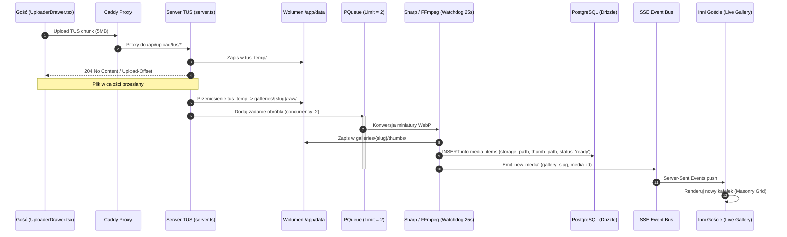

# Szczegółowy Przepływ Potoku Multimediów (Media Pipeline)

---

## Parametry Techniczne

| Element | Wartość | Cel |
|---|---|---|
| Rozmiar chunka TUS | 5 MB (`5 * 1024 * 1024`) | Optymalny transfer przez niestabilne Wi-Fi/LTE |
| Limit współbieżności | 2 zadania równoległe | Ochrona 4 rdzeni procesora Intel N100 |
| Timeout FFmpeg | 25 sekund (`SIGKILL`) | Zabezpieczenie przed zapętleniem uszkodzonych plików |
| Format miniatury | WebP, jakość 80 | Zmniejszenie transferu danych gości |
| Wymiary miniatury | max 500x500 px | Szybkie renderowanie na urządzeniach mobilnych |
| Fallback polling | 1s, 2.5s, 5s | Cicha weryfikacja w tle na wypadek przerwania SSE |
