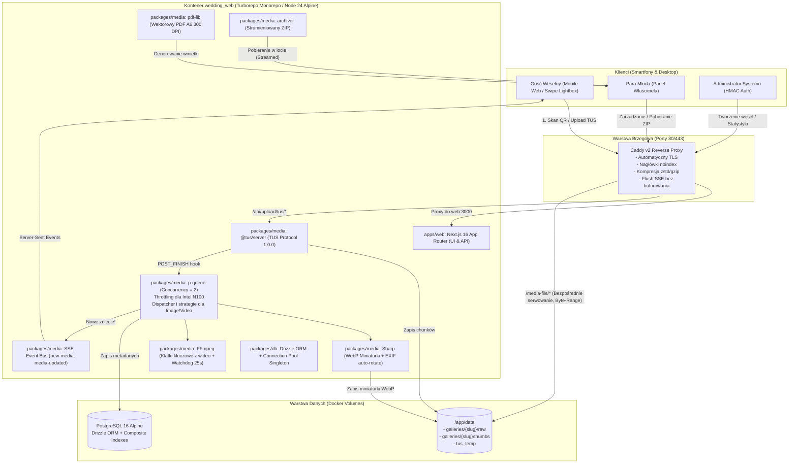

# Dokumentacja Techniczna i Architektura: WeddingDrop 💍

Kompleksowa dokumentacja techniczna, architektoniczna i operacyjna samoobsługowej platformy do zbierania zdjęć i filmów weselnych (self-hosted alternative to Fotowrzutka.pl), zoptymalizowanej pod kątem procesorów o niskim poborze mocy (np. Intel N100).

---

## 1. Przegląd i Koncepcja Rozwiązania

WeddingDrop rozwiązuje problem zbierania materiałów foto/wideo od gości weselnych bez konieczności:
- Pobierania jakichkolwiek aplikacji ze sklepów (Google Play / App Store).
- Zakładania kont, logowania i podawania e-maili przez gości.
- Płacenia abonamentów i godzenia się na limity miejsc/czasu.
- Utraty jakości zdjęć (brak kompresji niszczącej oryginały, pliki źródłowe zachowywane 1:1).

System jest w pełni wielotenantowy (możliwość obsługi nieskończonej liczby wesel w ramach jednej instancji).

---

## 2. Diagram Architektury Systemu



---

## 3. Cykl Życia Zdjęcia / Wideo (Upload Flow)

1. **Skanowanie**: Gość skanuje kod QR ze stolika, otwierając adres `https://domena.pl/g/kasia-i-tomek`.
2. **Inicjalizacja Uploadu**: Klient (`UploaderDrawer.tsx`) dynamicznie ustala endpoint w oparciu o `window.location.origin` (`/api/upload/tus`), co zapobiega rozbieżnościom protokołów HTTP/HTTPS. Serwer TUS zwraca relatywny nagłówek `Location` (`relativeLocation: true`), eliminując błędy CORS i niepożądane przekierowania preflight 308 za proxy Caddy.
3. **Wznawialny Transfer**: Plik przesyłany jest w kawałkach po 5 MB (`chunkSize: 5MB`). Jeśli gość wejdzie w martwą strefę zasięgu sali, transfer zostaje wstrzymany i po ponownym złapaniu sygnału wznawia się automatycznie od ostatniego bajtu (zero powtórek).
4. **Hook Zakończenia (`POST_FINISH`)**:
   - Plik z tymczasowego katalogu `tus_temp` trafia do `/data/galleries/{slug}/raw/`.
   - Zadanie obróbki trafia do kolejki `p-queue` (max 2 zadania współbieżne dla ochrony 4 rdzeni procesora N100).
5. **Przetwarzanie**:
   - **Zdjęcia**: `Sharp` odczytuje orientację EXIF (np. zdjęcia pionowe z iPhone'a) i generuje zoptymalizowaną miniaturkę WebP 500x500 z zachowaniem proporcji.
   - **Wideo**: `FFmpeg` wycina klatkę z pierwszej sekundy wideo i konwertuje ją do formatu WebP.
   - **Watchdog FFmpeg**: Proces `ffmpeg` uruchamiany jest z twardym limitem czasu (25 sekund). W razie zawieszenia na uszkodzonym pliku wideo proces zostaje bezwzględnie ubity (`SIGKILL`), uniemożliwiając zablokowanie kolejki zadań (`p-queue starvation`).
6. **Zapis i Real-Time Notyfikacja**:
   - Ścieżki dyskowe zapisywane są w bazie PostgreSQL z wymuszeniem separatorów uniksowych (`path.posix.join`), gwarantując pełną zgodność niezależnie od systemu operacyjnego.
   - Rekord zostaje utrwalony w tabeli `media_items` PostgreSQL.
   - Magistrala `sseBus` (zarejestrowana w `globalThis.__wedding_sse_bus__` jako globalny singleton procesu Node) emituje zdarzenie `new-media` dla danego sluga galerii.
   - Wszystkie podłączone smartfony na sali weselnej otrzymują powiadomienie przez otwarty strumień SSE i natychmiast renderują nowe zdjęcie w siatce Masonry (bez zakłócania otwartego u innego gościa Lightboxa).
   - Dodatkowo interfejs gościa realizuje cichy fallback polling (po 1s, 2.5s i 5s) w tle na wypadek chwilowego zerwania strumienia SSE podczas obróbki długiego materiału wideo.

---

## 4. Model Bazy Danych (PostgreSQL)

### Tabela `galleries`
| Kolumna | Typ | Opis |
|---|---|---|
| `id` | UUID | Klucz główny (`defaultRandom()`) |
| `slug` | TEXT UNIQUE | Unikalny identyfikator URL (np. `kasia-i-tomek`), sanityzowany `^[a-z0-9_-]+$` |
| `couple_names` | TEXT | Imiona Pary Młodej (np. `Katarzyna & Tomasz`) |
| `wedding_date` | TEXT | Data wesela |
| `owner_email` | TEXT | Adres e-mail pary |
| `owner_password_hash` | TEXT | Hasz hasła właściciela (bcrypt) |
| `access_pin` | TEXT | Opcjonalny 4-cyfrowy PIN dla gości |
| `is_active` | BOOLEAN | Status aktywności galerii (domyślnie `true`) |
| `allow_guest_downloads` | BOOLEAN | Zezwolenie gościom na pobieranie zdjęć w pełnej rozdzielczości i ZIP |
| `allow_videos` | BOOLEAN | Zgoda na wrzucanie plików wideo |
| `max_storage_bytes` | BIGINT | Limit miejsca (0 = bez limitu) |
| `created_at` | TIMESTAMPTZ | Znacznik czasu utworzenia |

### Tabela `gallery_gdrive_exports`
| Kolumna | Typ | Opis |
|---|---|---|
| `id` | UUID | Klucz główny |
| `gallery_id` | UUID FK | Odwołanie do `galleries.id` (`ON DELETE CASCADE`), relacja 1:1 |
| `refresh_token` | TEXT | Token odświeżania OAuth 2.0 |
| `account_email` | TEXT | Zautoryzowany adres e-mail dysku |
| `root_folder_id` | TEXT | Główne ID folderu wesela na dysku |
| `photos_folder_id` | TEXT | ID folderu na zdjęcia |
| `videos_folder_id` | TEXT | ID folderu na filmy |
| `hidden_folder_id` | TEXT | ID folderu na ukryte pliki |
| `export_status` | TEXT | Status eksportu (`idle`, `running`, `completed`, `failed`, `interrupted`) |
| `export_progress` | JSONB | Bieżący postęp (`processedFiles`, `totalFiles`, `processedBytes` itp.) |
| `exported_at` | TIMESTAMPTZ | Data ostatniego eksportu |
| `created_at` | TIMESTAMPTZ | Znacznik czasu utworzenia |

### Tabela `card_settings`
| Kolumna | Typ | Opis |
|---|---|---|
| `id` | UUID | Klucz główny |
| `gallery_id` | UUID FK | Odwołanie do `galleries.id` (`ON DELETE CASCADE`) |
| `headline` | TEXT | Główny nagłówek karteczki |
| `subheadline` | TEXT | Podtytuł |
| `primary_color` | TEXT | Kolor główny tekstów i kodu QR (kod HEX) |
| `accent_color` | TEXT | Kolor ozdobnej ramki (kod HEX, np. złoto `#D4AF37`) |
| `paper_size` | TEXT | Format papieru (`A6`) |
| `custom_instructions`| TEXT | Treść instrukcji punktowej dla gości |

### Tabela `media_items`
| Kolumna | Typ | Opis |
|---|---|---|
| `id` | UUID | Klucz główny |
| `gallery_id` | UUID FK | Odwołanie do `galleries.id` (`ON DELETE CASCADE`) |
| `uploader_name` | TEXT | Podpis gościa (np. "Świadek Piotr") |
| `file_type` | TEXT | `image` lub `video` |
| `mime_type` | TEXT | Typ MIME (np. `image/jpeg`, `video/mp4`) |
| `original_file_name` | TEXT | Pierwotna nazwa pliku z telefonu |
| `file_size` | BIGINT | Rozmiar w bajtach |
| `storage_path` | TEXT | Znormalizowana ścieżka względna do pliku źródłowego |
| `thumb_path` | TEXT | Znormalizowana ścieżka względna do miniatury WebP |
| `status` | TEXT | `ready` (widoczne), `hidden` (ukryte przez parę), `deleted` |
| `created_at` | TIMESTAMPTZ | Czas dodania |

### Indeksy Wydajnościowe Bazy Danych
Dla zapewnienia błyskawicznego działania zapytań SQL na tysiącach zdjęć utworzono dedykowane indeksy złożone:
1. `idx_media_items_gallery_status_created` – indeks na kolumnach `(gallery_id, status, created_at DESC)`:
   - Eliminuje pełne przeszukiwanie tabeli (`Seq Scan`) podczas pobierania zdjęć galerii gości i właściciela.
2. `idx_media_items_gallery_size` – indeks na `(gallery_id, file_size)`:
   - Zapewnia natychmiastowe obliczanie sumy zajętego miejsca (`SUM(file_size)`) dla statystyk w panelu administratora i pary młodej.

### Tabela `admins`
| Kolumna | Typ | Opis |
|---|---|---|
| `id` | UUID | Klucz główny |
| `username` | TEXT UNIQUE | Login administratora |
| `password_hash` | TEXT | Hasz hasła administratora (bcrypt) |

---

## 5. Wykaz Endpointów API

### Publiczne (Gość)
- `GET /api/gallery/:slug` – Metadane galerii, status aktywności i ustawienia winietki.
- `GET /api/gallery/:slug/media` – Lista aktywnych multimediów (`status: "ready"`):
  - Parametr `?includeHidden=true` wymaga autoryzacji nagłówkiem `Authorization: Bearer <adminToken>` lub nagłówkiem `x-owner-password: <password>` (ewentualnie `?password=`). Próba nieautoryzowanego odczytu zwraca `401 Unauthorized`.
  - Pozycje o statusie `status: "deleted"` są bezwzględnie odfiltrowywane.
- `GET /api/gallery/:slug/live` – Strumień Server-Sent Events (SSE):
  - Emisja `new-media`: powiadomienie o nowym przetworzonym zdjęciu.
  - Emisja `media-updated`: natychmiastowa aktualizacja widoczności (ukrycie/odkrycie/usunięcie) synchronizowana na żywo na ekranach wszystkich gości.
- `ANY /api/upload/tus/*` – W pełni zgodny ze specyfikacją protokół TUS 1.0.0 (`POST`, `PATCH`, `HEAD`, `OPTIONS`, `DELETE`).
- `GET /api/gallery/:slug/card/pdf` – Wektorowy dokument PDF A6 (300 DPI) generowany w locie:
  - Obsługuje zapytanie z parametrami URL (`headline`, `primaryColor`, `accentColor`, `instructions`), dzięki czemu pobierany plik od razu odzwierciedla stan edytora wizualnego bez wymogu uprzedniego zapisu w bazie.
  - Generuje prawidłowy kod QR z dynamicznym wykrywaniem hosta (brak sztywnego kodowania domen lokalnych).
- `GET /api/gallery/:slug/zip` – Strumieniowane archiwum ZIP ze wszystkimi zdjęciami:
  - Weryfikuje uprawnienie `allowGuestDownloads` oraz PIN galerii.
  - Przy podaniu hasła właściciela (`?password=`) do archiwum dołączane są również zdjęcia ukryte (`status: "hidden"`).
  - Oparte o nowoczesny strumień `ZipArchive` z pakietu `archiver` (brak buforowania gigabajtów w RAM).
- `GET /media-file/*` – Bezpośrednie serwowanie statycznych plików przez zoptymalizowane proxy Caddy (bez udziału Node.js), z pełną obsługą cache i nagłówków Byte-Range.

### Panel Pary Młodej (RESTful API)
- `POST /api/owner/:slug/auth` – Logowanie hasłem właściciela, wydanie podpisanego tokenu HMAC-SHA256, zwrócenie statystyk galerii, stanu Google Drive i konfiguracji winietki.
- `PATCH /api/owner/:slug/media/:id/status` – Zmiana widoczności zdjęcia (`ready` <-> `hidden`) autoryzowana tokenem HMAC, wraz z natychmiastową emisją SSE `media-updated`.
- `DELETE /api/owner/:slug/media/:id` – Fizyczne usunięcie pliku źródłowego i miniatury z dysku oraz bazy danych z powiadomieniem SSE.
- `PUT /api/owner/:slug/card` – Zapis zmodyfikowanych kolorów i tekstów winietki.
- `GET /api/owner/:slug/gdrive` – Pobranie aktualnego stanu transferu, liczby przetworzonych bajtów i linku do folderu Google Drive.
- `POST /api/owner/:slug/gdrive/export` – Uruchomienie asynchronicznego eksportu multimediów na Dysk Google w tle z opcją dołączenia ukrytych zdjęć.
- `DELETE /api/owner/:slug/gdrive` – Bezpieczne odłączenie konta Google Drive i usunięcie tokenów z bazy.
- `GET /api/auth/google` – Inicjalizacja autoryzacji Google OAuth 2.0 (weryfikacja tokenu HMAC, podpis stanu, wymuszenie offline refresh_token).
- `GET /api/auth/google/callback` – Obsługa zwrotna OAuth 2.0, weryfikacja integralności tokena stanu, wymiana kodu na refresh token i przekierowanie z powrotem do panelu.

### Panel Administratora (RESTful API)
- `POST /api/admin/auth` – Logowanie administratora, weryfikacja hasła i generowanie podpisanego tokena HMAC-SHA256 o ważności 7 dni.
- `GET /api/admin/galleries` – Zestawienie wszystkich wesel z dynamicznie agregowanymi statystykami dyskowymi.
- `POST /api/admin/galleries` – Tworzenie nowego wesela ze ścisłą walidacją sluga (`^[a-z0-9_-]+$`), generowaniem struktury folderów i haszowaniem hasła.
- `DELETE /api/admin/galleries/:id` – Całkowite i bezpowrotne usunięcie galerii z bazy oraz fizyczne usunięcie powiązanego katalogu z dysku.

---

## 6. UX i Interakcja Mobilna

1. **Pełnoekranowa Przeglądarka (LightboxModal)**:
   - **Natywna obsługa gestów dotykowych Swipe**: Użytkownik smartfona może płynnie przesuwać zdjęcia w lewo i w prawo palcem.
   - **Nawigacja klawiaturą**: Klawisze Strzałka w lewo / w prawo oraz Escape do zamykania.
   - **Stabilność indeksu przy transmisji SSE**: Napływ nowych zdjęć od innych gości na sali weselnej nie powoduje nieoczekiwanego przeskakiwania aktualnie oglądanego zdjęcia w powiększeniu.
2. **Kreator Karteczek na Stoły (`/g/[slug]/card`)**:
   - Przeniesiony do strefy zarządzania dla Pary Młodej (wyeliminowano zbędne odnośniki z nagłówka gościa).
   - Dynamiczny podgląd na żywo stylów i kolorów.
   - Pobieranie PDF przekazuje aktualne parametry edytora bezpośrednio do generatora `pdf-lib`.

---

## 7. Procedury Kopiowania Zapasowego i Przywracania (Backup)

Wszystkie dane aplikacji znajdują się w dwóch dedykowanych wolumenach Dockera:
1. `postgres_data` – Baza danych relacyjnych.
2. `app_data` – Fizyczne zdjęcia źródłowe, filmy i miniatury.

### Wykonanie Kopii Zapasowej (Backup):
```bash
# 1. Zrzut bazy danych PostgreSQL
docker exec -t wedding_postgres pg_dump -U wedding wedding_drop > wedding_backup_$(date +%F).sql

# 2. Archiwizacja plików multimedialnych
docker run --rm -v wedding-drop_app_data:/data -v $(pwd):/backup alpine tar -czf /backup/media_backup_$(date +%F).tar.gz -C /data .
```

### Przywrócenie z Kopii Zapasowej (Restore):
```bash
# 1. Przywrócenie bazy danych
cat wedding_backup_YYYY-MM-DD.sql | docker exec -i wedding_postgres psql -U wedding -d wedding_drop

# 2. Przywrócenie plików
docker run --rm -v wedding-drop_app_data:/data -v $(pwd):/backup alpine tar -xzf /backup/media_backup_YYYY-MM-DD.tar.gz -C /data
```

---

## 8. Bezpieczeństwo i Ochrona Prywatności

1. **Kryptograficzna Autoryzacja Administratora**:
   - Zamiast statycznych prefixów stosowany jest podpisany token HMAC-SHA256 (`admin_<timestamp>_<base64User>_<hmac>`).
   - Weryfikacja podpisu realizowana jest za pomocą `crypto.timingSafeEqual` w celu zapobieżenia atakom czasowym (Timing Attacks).
   - Token posiada 7-dniowy okres ważności.
2. **Ochrona przed Atakami Path Traversal (Directory Traversal)**:
   - Tworzenie sluga galerii (`customSlug`) jest ściśle sanityzowane wyrażeniem `replace(/[^a-z0-9_-]/g, "")`. Wszelkie znaki specjalne (`!@#`), spacje, kropki oraz ukośniki (`/`, `..`) są natychmiast usuwane, uniemożliwiając manipulację strukturą katalogów dyskowych.
   - Serwowanie plików multimedialnych dla endpointu `/media-file/*` zostało oddelegowane do webserwera Caddy, co niweluje ryzyko ataków typu directory traversal na poziomie Node.js, oferując przy okazji bardzo wysoką wydajność, w tym natywną obsługę zapytań `Byte-Range`.
3. **Prywatność Zdjęć Ukrytych**:
   - Zdjęcia o statusie `hidden` oraz `deleted` są niedostępne dla publicznych zapytań gości.
   - Próba odczytu zdjęć ukrytych parametrem `includeHidden=true` bez poświadczeń właściciela kończy się błędem HTTP 401.
4. **Brak Indeksowania przez Wyszukiwarki (SEO / RODO)**:
   - Caddy wysyła nagłówek brzegowy: `X-Robots-Tag: noindex, nofollow, noarchive, nosnippet`.
   - Każda strona HTML posiada meta tag `<meta name="robots" content="noindex, nofollow, noarchive" />`.
5. **Ochrona Zasobów Maszyny (Intel N100 Anti-DoS)**:
   - Pobieranie ZIP realizowane jest wyłącznie strumieniowo (`chunked transfer`) – serwer nie ładuje całego archiwum do pamięci RAM.
   - Kolejka obróbki `p-queue` jest ograniczona do `concurrency: 2`.
   - Watchdog `ffmpeg` (25s timeout) chroni przed zawieszeniem wątków procesora na uszkodzonych plikach wideo.
6. **Fizyczna Izolacja Danych**:
   - Każde wesele posiada unikalny slug oraz odizolowany folder dyskowy.
   - Skasowanie wesela z poziomu panelu administratora fizycznie usuwa pliki z dysku za pomocą `fs.rm`.
7. **Bezpieczeństwo CORS i Zgodność z HTTPS**:
   - Serwer TUS zwraca relatywne adresy zasobów (`relativeLocation: true`), co uniemożliwia niezgodność protokołów za reverse proxy Caddy (brak blokad CORS preflight).

---

## 9. Strategia Testów i Narzędzia Jakościowe (Turborepo + Biome)

Projekt objęty jest dwupoziomową piramidą testów automatycznych oraz standardami Biome:

1. **Jakość Kodu i Formatowanie (Biome)**:
   - Zastąpiono ESLint i Prettier nowoczesnym linterem/formatterem **Biome**.
   - Weryfikacja: `pnpm biome check apps/ packages/`.
   - Weryfikacja typów TypeScript w całym monorepo: `pnpm -r check-types`.

2. **Testy Jednostkowe i Integracyjne (Vitest)**:
   - Liczba testów: **80 testów** w 11 plikach.
   - `packages/media/tests/`: 28 testów potoku przetwarzania mediów, integracji Google Drive i wznawialnego serwera TUS.
   - `apps/web/tests/`: 52 testy integracyjne tras API (`admin`, `gallery`, `owner`) oraz komponentów UI (`LightboxModal`, `MediaGrid`, `UploaderDrawer`).
   - Uruchomienie: `pnpm turbo run test` lub `docker run --rm -v "${PWD}:/app" -w /app node:24-alpine sh -c "corepack enable && pnpm -r test"`

3. **Testy End-to-End (Playwright)**:
   - Liczba testów: **32 unikalne scenariusze (96 testów łącznych)** w katalogu `apps/web/e2e/`.
   - Macierz środowiskowa: **Desktop Chromium**, **Mobile Chrome (Pixel 5)**, **Mobile Safari (iPhone 13 / WebKit)**.
   - Uruchomienie: `pnpm --filter @wedding-drop/web test:e2e` lub w sieci Docker:
     `docker run --rm --network wedding-drop_wedding_net -v wedding_playwright_browsers:/ms-playwright -v "${PWD}:/app" -w /app/apps/web -e BASE_URL=http://wedding_web:3000 mcr.microsoft.com/playwright:v1.50.0-noble npx playwright test`

---

## 10. Konfiguracja Integracji z Google Drive (Google Cloud Console)

Aby Para Młoda mogła podłączyć swój Dysk Google i wykonać eksport:

1. **Utworzenie projektu**:
   - Przejdź do [Google Cloud Console](https://console.cloud.google.com/) i utwórz nowy projekt (np. `WeddingDrop`).
2. **Włączenie API**:
   - W sekcji **APIs & Services > Library** wyszukaj **Google Drive API** i kliknij **Enable**.
3. **Ekran zgody OAuth (OAuth consent screen)**:
   - Wybierz typ: **External**.
   - Podaj nazwę aplikacji (np. `WeddingDrop`) oraz adresy e-mail wsparcia.
   - W sekcji **Scopes** dodaj zakres: `https://www.googleapis.com/auth/drive.file` oraz `https://www.googleapis.com/auth/userinfo.email`.
   - **Ważne (Tryb Produkcyjny)**: Kliknij **Publish App** (przełącz na "In Production"). Ponieważ zakres `drive.file` jest bezpieczny i ograniczony wyłącznie do plików utworzonych przez aplikację, **nie wymaga płatnego ani długiego audytu bezpieczeństwa Google**. Zapobiega to wygasaniu tokenów `refresh_token` po 7 dniach.
4. **Dane logowania (Credentials)**:
   - Utwórz **OAuth client ID** z typem aplikacji **Web application**.
   - W polu **Authorized redirect URIs** dodaj adres URL callbacku Twojej instancji, np.:
     - `https://twoja-domena.pl/api/auth/google/callback` (środowisko produkcyjne)
     - `http://localhost:3000/api/auth/google/callback` (środowisko deweloperskie)
5. **Zmienne środowiskowe (`.env`)**:
   - Skopiuj wygenerowane poświadczenia do pliku `.env`:
     ```env
     GOOGLE_CLIENT_ID=twoj_klient_id.apps.googleusercontent.com
     GOOGLE_CLIENT_SECRET=twoj_klient_secret
     ```

---

## 11. Publikacja Obrazu Docker (GHCR) i Instalacja na ZimaOS/CasaOS

### Workflow CI/CD (`.github/workflows/docker-publish.yml`)
Przy każdym pushu na `main` oraz przy tagu `v*.*.*` GitHub Actions buduje obraz `web` (`Dockerfile` w katalogu głównym, wyłącznie `linux/amd64` — celowo bez multi-arch, ponieważ docelowy sprzęt N100/ZimaBoard jest x86-64-only, a `Dockerfile` i tak zawiera statycznie skompilowany FFmpeg tylko dla amd64) i publikuje go do GitHub Container Registry:
- `ghcr.io/p4cino/wedding-drop:latest` — najnowszy build z `main`.
- `ghcr.io/p4cino/wedding-drop:vX.Y.Z` — build z tagu wydania (semver).
- `ghcr.io/p4cino/wedding-drop:sha-<short>` — build przypięty do konkretnego commitu.

Serwisy `postgres` (`postgres:16-alpine`) i `caddy` (`caddy:2-alpine`) korzystają ze standardowych obrazów publicznych — nie są publikowane w GHCR, bo nie wymagają żadnych modyfikacji.

**Jednorazowa konfiguracja repozytorium (ręczna, nie da się jej wykonać z kodu):**
- Settings → Actions → General → Workflow permissions → **"Read and write permissions"** (inaczej `GITHUB_TOKEN` nie ma prawa publikować pakietów).
- Po pierwszym udanym uruchomieniu workflow: profil GitHub → Packages → `wedding-drop` → Package settings → Change visibility → **Public** (żeby `docker pull` na ZimaOS działał bez logowania do rejestru).

### Plik `docker-compose.prod.yml`
W odróżnieniu od `docker-compose.yml` (który buduje `web` lokalnie z Dockerfile), ten plik tylko pobiera gotowe obrazy i nie ma żadnych bind mountów do plików z repo — jest w pełni samodzielny, dzięki czemu da się go wkleić jako czysty tekst w importerze compose ZimaOS/CasaOS (zweryfikowano w oficjalnym repo manifestów `IceWhaleTech/CasaOS-AppStore` oraz docs.zimaspace.com, że ten import jest tekstowy i nie obsługuje dołączania osobnych plików konfiguracyjnych).

**Mechanizm zdalnego Caddyfile**: serwis `caddy` używa standardowego obrazu `caddy:2-alpine`, ale nadpisuje `command`, żeby najpierw ściągnąć `Caddyfile` z `raw.githubusercontent.com`, a potem odpalić Caddy na tej lokalnej kopii:
```yaml
command:
  [
    "sh",
    "-c",
    "wget -qO /etc/caddy/Caddyfile https://raw.githubusercontent.com/p4cino/wedding-drop/<tag>/Caddyfile && caddy run --config /etc/caddy/Caddyfile --adapter caddyfile",
  ]
```
**Ważne**: `caddy run --config <url>` **nie** ściąga configu zdalnie samodzielnie — potwierdzone w praktyce jako crash-loop kontenera z błędem `open https://...: no such file or directory` (Caddy próbuje `os.Open()` na URL-u jak na lokalnej ścieżce). Stąd wrapper `wget` przed uruchomieniem `caddy run`. To zastępuje bind mount `./Caddyfile:/etc/caddy/Caddyfile` z `docker-compose.yml`, którego import ZimaOS (tekst-only, patrz niżej) nie obsługuje. URL jest przypięty do konkretnego tagu wydania (nie do `main`), żeby konfiguracja nie zmieniała się nieoczekiwanie przy restarcie; kontener wymaga dostępu do internetu przy każdym starcie/restarcie.

### Instalacja na ZimaOS
Zweryfikowana ścieżka w interfejsie ZimaOS (App Center → **"Install a Customized App"** → Import → zakładka **Docker Compose** → wklejenie YAML → Submit → Install) nie wymaga bloku `x-casaos` — jest to standardowy Docker Compose v2 pod maską; blok `x-casaos` jest potrzebny tylko przy zgłaszaniu aplikacji do publicznego App Store (poza zakresem tego projektu). Plik `docker-compose.prod.yml` unika też składni właściwej tylko dla Docker Swarm (np. blok `deploy.resources.limits`), która potwierdzono jako powodującą błędy importu w CasaOS/ZimaOS — ewentualne limity CPU/RAM dla kontenerów N100 można ustawić już po instalacji z poziomu UI ZimaOS.

**Primary Service musi być `caddy`, nie `web`**: `web` nie publikuje żadnego portu (dostępny tylko wewnątrz `wedding_net`) — to `caddy` jest jedynym zamierzonym punktem wejścia (serwuje `/media-file/*`, dodaje nagłówki bezpieczeństwa/`noindex`, patrz architektura wyżej). Ustawienie `web` jako Primary Service prowadzi ZimaOS do próby wystawienia portu 3000 wprost na hosta, co całkowicie omija Caddy.

**Konflikt portów 80/443/8080/8443 (potwierdzone empirycznie, wielokrotnie na tym samym NAS-ie)**: import z portami zajętymi przez inne działające kontenery (dashboard ZimaOS, Nginx Proxy Manager, i wiele innych self-hosted appek notorycznie siedzących na tych samych "popularnych" portach) kończy się błędem walidacji „there are ports in use” w formularzu ZimaOS. Nie da się zahardkodować portów gwarantowanie wolnych dla każdego NAS-a — trzeba sprawdzić, co jest już zajęte (`sudo docker ps -a --format 'table {{.Names}}\t{{.Ports}}'` i/lub `sudo ss -tlnp`) i wpisać w formularzu ZimaOS jakikolwiek wolny numer dla obu portów `caddy` (host-side; kontener wewnątrz zawsze nasłuchuje na 80/443).

**Dopasowanie Host header w Caddyfile (potwierdzone empirycznie)**: samo przemapowanie portu hosta nie wystarcza. Caddyfile `{$APP_DOMAIN:localhost} { ... }` tworzy site block dopasowywany **po nagłówku `Host`** requestu. Gdy dostęp idzie przez zmapowany port (np. `http://192.168.1.107:2137`), przeglądarka wysyła `Host: 192.168.1.107:2137` — to nie jest `localhost`, więc site block się nie dopasowuje, a Caddy zwraca domyślną, puste odpowiedź `200 OK` / `Content-Length: 0` (bez żadnych naszych nagłówków) — objawia się jako biała strona. Ustawienie `APP_DOMAIN` samego serwisu `caddy` na `":80"` (tylko port, bez hosta) naprawia to: taki adres dopasowuje **każdy** Host header na porcie 80 wewnątrz kontenera, niezależnie od tego, na jaki port hosta go zmapowano, i jednocześnie wyłącza automatyczne HTTPS (nie ma domeny, dla której Caddy mógłby próbować zdobyć certyfikat). Kto ma realną domenę i wolne 80/443, może ustawić `APP_DOMAIN` na tę domenę (np. `mojawesele.pl`) dla automatycznego Let's Encrypt.

### Rozwiązywanie problemów (SSH)
Diagnostyka krok po kroku, gdy appka nie odpowiada poprawnie po instalacji:
```bash
# 1. Status wszystkich kontenerow - szukaj Restarting/Exited
sudo docker ps -a --format 'table {{.Names}}\t{{.Image}}\t{{.Status}}\t{{.Ports}}'

# 2. Logi konkretnego kontenera ktory nie jest "Up"
sudo docker logs wedding_caddy --tail 100
sudo docker logs wedding_web --tail 100
sudo docker logs wedding_postgres --tail 100

# 3. Realna odpowiedz HTTP (status, naglowki, body) - odrozni blad 500/404
#    od "caddy odpowiada 200 ale nie tym co powinien" (patrz wyzej)
curl -sv http://<ip-nas>:<port>/ 2>&1 | head -40

# 4. Lista zajetych portow na calym NAS-ie, przy konflikcie
sudo ss -tlnp
```
