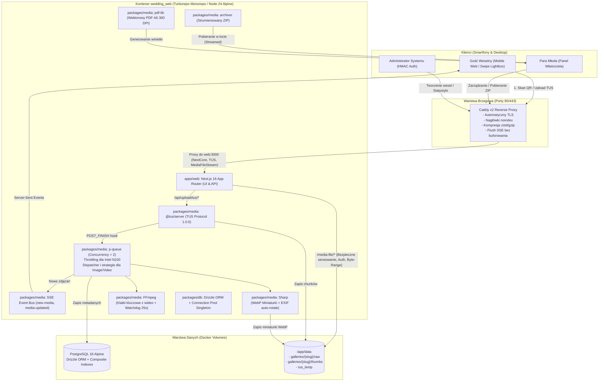

# Dokumentacja Techniczna i Architektura: WeddingDrop 💍

Kompleksowa dokumentacja techniczna, architektoniczna i operacyjna samoobsługowej platformy do zbierania zdjęć i filmów weselnych (self-hosted alternative to Fotowrzutka.pl), zoptymalizowanej pod kątem procesorów o niskim poborze mocy (np. Intel N100).

---

## 1. Przegląd i Koncepcja Rozwiązania

WeddingDrop rozwiązuje problem zbierania materiałów foto/wideo od gości weselnych bez konieczności:
- Pobierania jakichkolwiek aplikacji ze sklepów (Google Play / App Store).
- Zakładania kont, logowania i podawania e-maili przez gości.
- Płacenia abonamentów i godzenia się na limity miejsc/czasu.
- Utraty jakości zdjęć (brak kompresji niszczącej oryginały, pliki źródłowe zachowywane 1:1).

System jest w pełni wielotenantowy (możliwość obsługi nieskończonej liczby wesel w ramach jednej instancji).

---

## 2. Diagram Architektury Systemu


```mermaid
graph TD
    subgraph "Klienci (Smartfony & Desktop)"
        Guest["Gość Weselny (Mobile Web / Swipe Lightbox)"]
        Couple["Para Młoda (Panel Właściciela)"]
        Admin["Administrator Systemu (HMAC Auth)"]
    end

    subgraph "Warstwa Brzegowa (Porty 80/443)"
        Caddy["Caddy v2 Reverse Proxy\n- Automatyczny TLS\n- Nagłówki noindex\n- Kompresja zstd/gzip\n- Flush SSE bez buforowania"]
    end

    subgraph "Kontener wedding_web (Turborepo Monorepo / Node 24 Alpine)"
        NextCore["apps/web: Next.js 16 App Router (UI & API)"]
        TusServer["packages/media: @tus/server (TUS Protocol 1.0.0)"]
        SSEBus["packages/media: SSE Event Bus (new-media, media-updated)"]
        PdfGen["packages/media: pdf-lib (Wektorowy PDF A6 300 DPI)"]
        ZipStream["packages/media: archiver (Strumieniowany ZIP)"]
        MediaQueue["packages/media: p-queue (Concurrency = 2)\nThrottling dla Intel N100\nDispatcher i strategie dla Image/Video"]
        Sharp["packages/media: Sharp (WebP Miniaturki + EXIF auto-rotate)"]
        FFmpeg["packages/media: FFmpeg (Klatki kluczowe z wideo + Watchdog 25s)"]
        DbPkg["packages/db: Drizzle ORM + Connection Pool Singleton"]
    end

    subgraph "Warstwa Danych (Docker Volumes)"
        Postgres[("PostgreSQL 16 Alpine\nDrizzle ORM + Composite Indexes")]
        Filesystem[("/app/data\n- galleries/{slug}/raw\n- galleries/{slug}/thumbs\n- tus_temp")]
    end

    Guest -->|"1. Skan QR / Upload TUS"| Caddy
    Couple -->|"Zarządzanie / Pobieranie ZIP"| Caddy
    Admin -->|"Tworzenie wesel / Statystyki"| Caddy

    Caddy -->|"Proxy do web:3000 (NextCore, TUS, MediaFileStream)"| NextCore
    NextCore -->|"/api/upload/tus/*"| TusServer
    NextCore -->|"/media-file/* (Bezpieczne serwowanie, Auth, Byte-Range)"| Filesystem

    TusServer -->|"Zapis chunków"| Filesystem
    TusServer -->|"POST_FINISH hook"| MediaQueue
    MediaQueue --> Sharp
    MediaQueue --> FFmpeg
    Sharp -->|"Zapis miniaturki WebP"| Filesystem
    MediaQueue -->|"Zapis metadanych"| Postgres
    MediaQueue -->|"Nowe zdjęcie!"| SSEBus
    SSEBus -->|"Server-Sent Events"| Guest

    ZipStream -->|"Pobieranie w locie (Streamed)"| Couple
    PdfGen -->|"Generowanie winietki"| Couple
```

---

## 3. Cykl Życia Zdjęcia / Wideo (Upload Flow)

1. **Skanowanie**: Gość skanuje kod QR ze stolika, otwierając adres `https://domena.pl/g/kasia-i-tomek`.
2. **Źródło pliku — rolka aparatu albo photobooth w przeglądarce**:
   - **Wybór z dysku/rolki**: standardowy `<input type="file" multiple>`.
   - **Photobooth w przeglądarce** (`CameraCapture.tsx`): opcja "Zrób zdjęcie" w `UploaderDrawer.tsx` uruchamia podgląd na żywo z kamery urządzenia gościa (`navigator.mediaDevices.getUserMedia({ video: { facingMode: { ideal: facingMode }, width: { ideal: 1920 }, height: { ideal: 1080 } }, audio: false })`) z automatyczną aktywacją ciągłego autofokusu (`focusMode: "continuous"`), bez potrzeby otwierania natywnej aplikacji aparatu. Gość może swobodnie przełączać się między głównym (tylnym) aparatem telefonu a aparatem przednim (selfie) za pomocą dedykowanego przycisku na podglądzie (automatycznie ukrywanego na urządzeniach z jedną kamerą, wykrywanych przez `enumerateDevices()`), a preferencja jest zapamiętywana w `localStorage`. Podgląd stosuje naturalne odbicie lustrzane wyłącznie dla kamery przedniej (`scale-x-[-1]`). Po naciśnięciu spustu migawki aparat podejmuje próbę pobrania pełnoklatkowego, natywnego ujęcia sensora za pośrednictwem API `ImageCapture.takePhoto()` (obsługiwanego w Chromium / Androidzie), a w razie braku wsparcia (np. iOS Safari) płynnie przełącza się na zrzut z wysokorozdzielczego elementu `<video>`. Zdjęcie jest komponowane na `<canvas>` (`captureSourceToCanvas`, z zachowaniem proporcji i skalowaniem w dół do maks. 2560px Quad HD po dłuższym boku), na wierzchu dokładana jest dekoracyjna ramka w kolorach motywu wesela (`primaryColor`/`accentColor` z `card_settings`, odczytane przez ten sam publiczny `GET /api/gallery/:slug` co reszta galerii, z domyślnymi kolorami generatora winietek, gdy galeria nie ma zapisanych ustawień), a canvas jest eksportowany przez `canvas.toBlob("image/jpeg", 0.95)` do zwykłego obiektu `File`. Ten plik trafia do **dokładnie tej samej** kolejki `files`/`startUpload`, co plik z wyboru z dysku — zero rozgałęzień w logice TUS poniżej ani w backendzie. Gdy przeglądarka odmówi dostępu do kamery lub jej nie posiada, komponent pokazuje czytelny komunikat błędu, a zwykły wybór pliku pozostaje w pełni funkcjonalny.
4. **Inicjalizacja Uploadu**: Klient (`UploaderDrawer.tsx`) dynamicznie ustala endpoint w oparciu o `window.location.origin` (`/api/upload/tus`), co zapobiega rozbieżnościom protokołów HTTP/HTTPS. Serwer TUS zwraca relatywny nagłówek `Location` (`relativeLocation: true`), eliminując błędy CORS i niepożądane przekierowania preflight 308 za proxy Caddy.
5. **Wznawialny Transfer**: Plik przesyłany jest w kawałkach po 5 MB (`chunkSize: 5MB`). Jeśli gość wejdzie w martwą strefę zasięgu sali, transfer zostaje wstrzymany i po ponownym złapaniu sygnału wznawia się automatycznie od ostatniego bajtu (zero powtórek).
6. **Hook Zakończenia (`POST_FINISH`)**:
   - Plik z tymczasowego katalogu `tus_temp` trafia do `/data/galleries/{slug}/raw/`.
   - Zadanie obróbki trafia do kolejki `p-queue` (max 2 zadania współbieżne dla ochrony 4 rdzeni procesora N100).
7. **Przetwarzanie**:
   - **Zdjęcia**: `Sharp` odczytuje orientację EXIF (np. zdjęcia pionowe z iPhone'a) i generuje zoptymalizowaną miniaturkę WebP 500x500 z zachowaniem proporcji.
   - **Wideo**: `FFmpeg` wycina klatkę z pierwszej sekundy wideo i konwertuje ją do formatu WebP.
   - **Watchdog FFmpeg**: Proces `ffmpeg` uruchamiany jest z twardym limitem czasu (25 sekund). W razie zawieszenia na uszkodzonym pliku wideo proces zostaje bezwzględnie ubity (`SIGKILL`), uniemożliwiając zablokowanie kolejki zadań (`p-queue starvation`).
8. **Zapis i Real-Time Notyfikacja**:
   - Ścieżki dyskowe zapisywane są w bazie PostgreSQL z wymuszeniem separatorów uniksowych (`path.posix.join`), gwarantując pełną zgodność niezależnie od systemu operacyjnego.
   - Rekord zostaje utrwalony w tabeli `media_items` PostgreSQL.
   - Magistrala `sseBus` (zarejestrowana w `globalThis.__wedding_sse_bus__` jako globalny singleton procesu Node) emituje zdarzenie `new-media` dla danego sluga galerii.
   - Wszystkie podłączone smartfony na sali weselnej otrzymują powiadomienie przez otwarty strumień SSE i natychmiast renderują nowe zdjęcie w siatce Masonry (bez zakłócania otwartego u innego gościa Lightboxa).
   - Dodatkowo interfejs gościa realizuje cichy fallback polling (po 1s, 2.5s i 5s) w tle na wypadek chwilowego zerwania strumienia SSE podczas obróbki długiego materiału wideo.

### 3.1. Import materiałów profesjonalnego fotografa/kamerzysty

Para Młoda może w panelu właściciela (`/owner/[slug]`, komponent `PhotographerImportPanel.tsx`) masowo zaimportować materiały otrzymane od profesjonalnego fotografa lub kamerzysty do tej samej galerii i chronologii co uploady gości, korzystając z dokładnie tego samego protokołu TUS 1.0.0 i tego samego endpointu `/api/upload/tus`. Różnice względem zwykłego uploadu gościa:

1. **Autoryzacja właściciela jest obowiązkowa**: metadane TUS niosą dodatkowe pola `source: "photographer"` i `ownerToken`. `onUploadCreate` w `packages/media/src/tus-server.ts` odrzuca (`401 Unauthorized`) każdy upload ze `source: "photographer"`, jeśli `ownerToken` nie zweryfikuje się poprawnie dla danej galerii — zanim jakikolwiek plik trafi na dysk lub do bazy. Weryfikacja odbywa się przez funkcję wstrzykiwaną z `apps/web/server.ts` (`verifyOwnerCredentialsForTus`, reużywającą istniejący `verifyOwnerToken` z `@/lib/auth`), aby `packages/media` nigdy nie importowało kodu z `apps/web` (zachowany kierunek zależności monorepo).
2. **Egzekwowanie limitu pojemności galerii (`maxStorageBytes`)**: to pierwsze miejsce w całym kodzie, w którym ta istniejąca od dawna kolumna jest faktycznie sprawdzana. Jeśli galeria ma ustawiony niezerowy limit, `onUploadCreate` sumuje dotychczasowe `file_size` z `media_items` i odrzuca (`413 Payload Too Large`) tylko ten pojedynczy plik importu, który przekroczyłby limit — pozostałe pliki tej samej paczki importu (każdy plik to osobne żądanie TUS) przechodzą normalnie. **Uwaga**: ten limit dotyczy wyłącznie ścieżki importu fotografa; zwykłe uploady gości pozostają nieograniczone (`maxStorageBytes` nie jest tam sprawdzane).
3. **Wspólna, ograniczona kolejka przetwarzania**: zaimportowane pliki trafiają do dokładnie tej samej kolejki `p-queue` (concurrency: 2) i tego samego watchdoga FFmpeg (25s SIGKILL) co uploady gości — brak priorytetu i osobnego limitu współbieżności. Masowy import wielu dużych plików w trakcie trwającej recepcji może chwilowo spowolnić przetwarzanie bieżących zdjęć gości; zalecane jest wykonywanie importu poza szczytem aktywności gości (np. dzień po weselu).
4. **Oznaczenie źródła**: każdy wpis w `media_items` ma kolumnę `source` (`"guest"` domyślnie, `"photographer"` dla importu). Materiały fotografa są widoczne w tej samej siatce galerii (gościa i właściciela) z odróżniającą odznaką "Fotograf" i podlegają dokładnie tej samej moderacji (ukrywanie/usuwanie, propagacja SSE) co materiały gości.

---

## 4. Model Bazy Danych (PostgreSQL)

### Tabela `galleries`
| Kolumna | Typ | Opis |
|---|---|---|
| `id` | UUID | Klucz główny (`defaultRandom()`) |
| `slug` | TEXT UNIQUE | Unikalny identyfikator URL (np. `kasia-i-tomek`), sanityzowany `^[a-z0-9_-]+$` |
| `couple_names` | TEXT | Imiona Pary Młodej (np. `Katarzyna & Tomasz`) |
| `wedding_date` | TEXT | Data wesela |
| `owner_email` | TEXT | Adres e-mail pary |
| `owner_password_hash` | TEXT | Hasz hasła właściciela (bcrypt) |
| `access_pin` | TEXT | Opcjonalny 4-cyfrowy PIN dla gości |
| `is_active` | BOOLEAN | Status aktywności galerii (domyślnie `true`) |
| `allow_guest_downloads` | BOOLEAN | Zezwolenie gościom na pobieranie zdjęć w pełnej rozdzielczości i ZIP |
| `allow_videos` | BOOLEAN | Zgoda na wrzucanie plików wideo |
| `max_storage_bytes` | BIGINT | Limit miejsca (0 = bez limitu) |
| `created_at` | TIMESTAMPTZ | Znacznik czasu utworzenia |

### Tabela `gallery_gdrive_exports`
| Kolumna | Typ | Opis |
|---|---|---|
| `id` | UUID | Klucz główny |
| `gallery_id` | UUID FK | Odwołanie do `galleries.id` (`ON DELETE CASCADE`), relacja 1:1 |
| `refresh_token` | TEXT | Token odświeżania OAuth 2.0 |
| `account_email` | TEXT | Zautoryzowany adres e-mail dysku |
| `root_folder_id` | TEXT | Główne ID folderu wesela na dysku |
| `photos_folder_id` | TEXT | ID folderu na zdjęcia |
| `videos_folder_id` | TEXT | ID folderu na filmy |
| `hidden_folder_id` | TEXT | ID folderu na ukryte pliki |
| `export_status` | TEXT | Status eksportu (`idle`, `running`, `completed`, `failed`, `interrupted`) |
| `export_progress` | JSONB | Bieżący postęp (`processedFiles`, `totalFiles`, `processedBytes` itp.) |
| `exported_at` | TIMESTAMPTZ | Data ostatniego eksportu |
| `created_at` | TIMESTAMPTZ | Znacznik czasu utworzenia |

### Tabela `card_settings`
| Kolumna | Typ | Opis |
|---|---|---|
| `id` | UUID | Klucz główny |
| `gallery_id` | UUID FK | Odwołanie do `galleries.id` (`ON DELETE CASCADE`) |
| `headline` | TEXT | Główny nagłówek karteczki |
| `subheadline` | TEXT | Podtytuł |
| `primary_color` | TEXT | Kolor główny tekstów i kodu QR (kod HEX) |
| `accent_color` | TEXT | Kolor ozdobnej ramki (kod HEX, np. złoto `#D4AF37`) |
| `paper_size` | TEXT | Format papieru (`A6`) |
| `custom_instructions`| TEXT | Treść instrukcji punktowej dla gości |

### Tabela `media_items`
| Kolumna | Typ | Opis |
|---|---|---|
| `id` | UUID | Klucz główny |
| `gallery_id` | UUID FK | Odwołanie do `galleries.id` (`ON DELETE CASCADE`) |
| `uploader_name` | TEXT | Podpis gościa (np. "Świadek Piotr") |
| `source` | TEXT | Źródło materiału: `guest` (domyślnie) lub `photographer` (import przez właściciela) |
| `file_type` | TEXT | `image` lub `video` |
| `mime_type` | TEXT | Typ MIME (np. `image/jpeg`, `video/mp4`) |
| `original_file_name` | TEXT | Pierwotna nazwa pliku z telefonu |
| `file_size` | BIGINT | Rozmiar w bajtach |
| `storage_path` | TEXT | Znormalizowana ścieżka względna do pliku źródłowego |
| `thumb_path` | TEXT | Znormalizowana ścieżka względna do miniatury WebP |
| `status` | TEXT | `ready` (widoczne), `hidden` (ukryte przez parę), `deleted` |
| `created_at` | TIMESTAMPTZ | Czas dodania |

### Indeksy Wydajnościowe Bazy Danych
Dla zapewnienia błyskawicznego działania zapytań SQL na tysiącach zdjęć utworzono dedykowane indeksy złożone:
1. `idx_media_items_gallery_status_created` – indeks na kolumnach `(gallery_id, status, created_at DESC)`:
   - Eliminuje pełne przeszukiwanie tabeli (`Seq Scan`) podczas pobierania zdjęć galerii gości i właściciela.
2. `idx_media_items_gallery_size` – indeks na `(gallery_id, file_size)`:
   - Zapewnia natychmiastowe obliczanie sumy zajętego miejsca (`SUM(file_size)`) dla statystyk w panelu administratora i pary młodej.

### Tabela `admins`
| Kolumna | Typ | Opis |
|---|---|---|
| `id` | UUID | Klucz główny |
| `username` | TEXT UNIQUE | Login administratora |
| `password_hash` | TEXT | Hasz hasła administratora (bcrypt) |

### Tabela `wishes`
Oddzielna, równoległa do `media_items` "księga życzeń" — tekstowe życzenia gości niezwiązane z żadnym plikiem, o identycznym kształcie stanu i moderacji.

| Kolumna | Typ | Opis |
|---|---|---|
| `id` | UUID | Klucz główny (`defaultRandom()`) |
| `gallery_id` | UUID FK | Odwołanie do `galleries.id` (`ON DELETE CASCADE`) |
| `guest_name` | TEXT (nullable) | Opcjonalne imię/nazwisko gościa — `NULL` wyświetlane w UI jako "Anonimowy gość" |
| `message` | TEXT | Treść życzenia (wymagane, max 500 znaków) |
| `status` | TEXT | `ready` (widoczne), `hidden` (ukryte przez parę), `deleted` (trwale usunięte — soft-delete, bo brak plików do fizycznego skasowania) |
| `created_at` | TIMESTAMPTZ | Czas dodania |

Indeks `idx_wishes_gallery_status_created` na `(gallery_id, status, created_at)` — identyczny wzorzec co `idx_media_items_gallery_status_created`, bo zapytania mają dokładnie ten sam kształt (lista życzeń danej galerii, filtrowana po statusie, sortowana chronologicznie).

---

## 5. Wykaz Endpointów API

### Publiczne (Gość)
- `GET /api/gallery/:slug` – Metadane galerii, status aktywności i ustawienia winietki, w tym `primaryColor`/`accentColor` motywu wesela (zawsze zwracane, z domyślnymi wartościami generatora winietek, gdy galeria nie ma zapisanych ustawień) — wykorzystywane m.in. przez ramkę photobooth w przeglądarce gościa (`CameraCapture.tsx`).
- `GET /api/gallery/:slug/media` – Lista aktywnych multimediów (`status: "ready"`):
  - Parametr `?includeHidden=true` wymaga autoryzacji nagłówkiem `Authorization: Bearer <adminToken>` / `x-admin-token`, nagłówkiem `x-owner-token`, ciasteczkiem sesji `wd_owner_{slug}` lub nagłówkiem `x-owner-password: <password>`. Poświadczenia w query stringu są ignorowane, a próba nieautoryzowanego odczytu zwraca `401 Unauthorized`.
  - Pozycje o statusie `status: "deleted"` są bezwzględnie odfiltrowywane.
- `GET /api/gallery/:slug/live` – Strumień Server-Sent Events (SSE):
  - Emisja `new-media`: powiadomienie o nowym przetworzonym zdjęciu.
  - Emisja `media-updated`: natychmiastowa aktualizacja widoczności (ukrycie/odkrycie/usunięcie) synchronizowana na żywo na ekranach wszystkich gości.
  - Emisja `new-wish`: powiadomienie o nowym życzeniu dodanym do księgi gości.
  - Emisja `wish-updated`: natychmiastowa aktualizacja widoczności życzenia (ukrycie/odkrycie/usunięcie) synchronizowana na żywo, tym samym wzorcem co `media-updated`.
- `ANY /api/upload/tus/*` – W pełni zgodny ze specyfikacją protokół TUS 1.0.0 (`POST`, `PATCH`, `HEAD`, `OPTIONS`, `DELETE`). Ten sam endpoint obsługuje zarówno upload gościa, jak i import fotografa (`source: "photographer"` w metadanych TUS): import fotografa wymaga dodatkowo poprawnego `ownerToken` (inaczej `401 Unauthorized`) i respektuje limit `maxStorageBytes` galerii (inaczej `413 Payload Too Large` dla konkretnego pliku) — patrz sekcja 3.1.
- `GET /api/gallery/:slug/card/pdf` – Wektorowy dokument PDF A6 (300 DPI) generowany w locie:
  - Obsługuje zapytanie z parametrami URL (`headline`, `primaryColor`, `accentColor`, `instructions`), dzięki czemu pobierany plik od razu odzwierciedla stan edytora wizualnego bez wymogu uprzedniego zapisu w bazie.
  - Generuje prawidłowy kod QR z dynamicznym wykrywaniem hosta (brak sztywnego kodowania domen lokalnych).
- `GET /api/gallery/:slug/zip` – Strumieniowane archiwum ZIP ze wszystkimi zdjęciami:
  - Dla gości: weryfikuje uprawnienie `allowGuestDownloads` oraz PIN galerii (`x-access-pin` lub `?pin=`).
  - Dla właściciela (autoryzacja ciasteczkiem sesji `wd_owner_{slug}`, nagłówkiem `x-owner-token` lub nagłówkiem `x-owner-password`): do archiwum dołączane są również zdjęcia ukryte (`status: "hidden"`), a pobieranie działa niezależnie od blokady pobierania gości. Poświadczenia w query stringu (`?password=`, `?token=`) są ignorowane ze względów bezpieczeństwa.
  - Oparte o nowoczesny strumień `ZipArchive` z pakietu `archiver` (brak buforowania gigabajtów w RAM).
  - Jeśli galeria zawiera widoczne życzenia (zgodnie z tymi samymi zasadami widoczności `hidden` co przy przeglądaniu przez właściciela), do archiwum dogrywany jest dodatkowy plik tekstowy `zyczenia.txt` z treścią i autorem każdego wpisu.
- `GET /media-file/*` – Bezpieczne serwowanie plików multimedialnych przez dedykowany handler Node.js (`apps/web/src/lib/media-file-handler.ts`) z ochroną przed Path Traversal (`path.resolve` w sandboxie `/data`), weryfikacją statusu pliku w bazie danych (blokada dostępu do mediów ukrytych/usuniętych dla nieautoryzowanych gości) oraz pełną obsługą strumieniowania i nagłówków Byte-Range (`206 Partial Content`).
- `POST /api/gallery/:slug/wishes` – Dodanie tekstowego życzenia do księgi gości (publiczne, bez logowania, bez pliku):
  - Waliduje `addWishDto` (treść wymagana, max 500 znaków; opcjonalne imię/nazwisko, max 60 znaków).
  - Odrzuca żądanie kodem `404`, gdy galeria nie istnieje, lub `400`, gdy jest nieaktywna albo treść jest pusta/nieprawidłowa.
  - Emitowana jest natychmiastowa notyfikacja SSE `new-wish`.
- `GET /api/gallery/:slug/wishes` – Lista życzeń, dokładnie ten sam wzorzec autoryzacji co `GET /api/gallery/:slug/media` (`includeHidden`, `ownerToken`/`password`/`adminToken`):
  - Bez poświadczeń zwraca wyłącznie życzenia o statusie `ready`.
  - Z poświadczeniami właściciela/administratora zwraca wszystkie poza `deleted`.
- `GET /g/:slug/tv` – **Nie jest to nowy endpoint API**, lecz publiczna trasa strony (komponent kliencki `apps/web/src/app/[locale]/g/[slug]/tv/page.tsx`) — tryb TV/pokaz slajdów na telewizor lub rzutnik. Pobiera dane wyłącznie z `GET /api/gallery/:slug/media` i `GET /api/gallery/:slug/live` powyżej, bez żadnych własnych zapytań do bazy i bez wysyłania nagłówków/parametrów właściciela — dziedziczy filtrowanie `status: "ready"` 1:1 z istniejących endpointów.

- `POST /api/owner/:slug/auth` – Logowanie hasłem właściciela, wydanie podpisanego tokenu HMAC-SHA256 w JSON oraz ciasteczka sesji `wd_owner_{slug}` (`HttpOnly; SameSite=Strict; Path=/api; Max-Age=7 dni; Secure` w produkcji). Zwraca statystyki galerii, stan Google Drive i konfigurację winietki.
- `GET /api/owner/:slug/session` – Przywrócenie aktywnej sesji właściciela na podstawie ciasteczka `wd_owner_{slug}` (wymaga metody GET). Odświeża ciasteczko sesji i zwraca świeży `ownerToken` oraz pełne dane panelu bez ponownego podawania hasła.
- `DELETE /api/owner/:slug/session` – Wylogowanie właściciela i wyczyszczenie ciasteczka sesji (`Max-Age=0`).
- Import materiałów fotografa/kamerzysty (`PhotographerImportPanel.tsx`) nie ma osobnego endpointu REST — korzysta z tego samego `ANY /api/upload/tus/*` co upload gościa, przekazując dodatkowo `ownerToken` z logowania właściciela oraz `source: "photographer"` w metadanych TUS (patrz sekcja 3.1 i 5 wyżej).
- `PATCH /api/owner/:slug/media/:id/status` – Zmiana widoczności zdjęcia (`ready` <-> `hidden`) autoryzowana tokenem HMAC (nagłówek `x-owner-token` lub `body.token`), wraz z natychmiastową emisją SSE `media-updated`.
- `DELETE /api/owner/:slug/media/:id` – Fizyczne usunięcie pliku źródłowego i miniatury z dysku oraz bazy danych autoryzowane nagłówkiem `x-owner-token` lub `body.token` (ciasteczko nie wystarcza dla operacji mutujących).
- `PATCH /api/owner/:slug/wishes/:id/status` – Moderacja życzenia autoryzowana tokenem HMAC (`authenticateOwner`), analogicznie do moderacji zdjęć:
  - `newStatus: "hidden"` ukrywa życzenie przed gośćmi, `"ready"` przywraca widoczność, `"deleted"` trwale je usuwa (soft-delete — brak plików do fizycznego skasowania, więc wystarczy zmiana statusu).
  - Emisja SSE `wish-updated` synchronizuje zmianę na żywo ze wszystkimi otwartymi widokami galerii.
- `PUT /api/owner/:slug/card` – Zapis zmodyfikowanych kolorów i tekstów winietki.
- `GET /api/owner/:slug/gdrive` – Pobranie aktualnego stanu transferu, liczby przetworzonych bajtów i linku do folderu Google Drive.
- `POST /api/owner/:slug/gdrive/export` – Uruchomienie asynchronicznego eksportu multimediów na Dysk Google w tle z opcją dołączenia ukrytych zdjęć.
- `DELETE /api/owner/:slug/gdrive` – Bezpieczne odłączenie konta Google Drive i usunięcie tokenów z bazy.
- `POST /api/auth/google` – Inicjalizacja autoryzacji Google OAuth 2.0 (body `{ slug }`, autoryzacja nagłówkiem `x-owner-token` / `Authorization: Bearer` lub `x-owner-password`). Zwraca `200 { authUrl }` z podpisanym stanem HMAC do nawigacji po stronie klienta (eliminacja poświadczeń z adresów URL).
- `GET /api/auth/google/callback` – Obsługa zwrotna OAuth 2.0, weryfikacja integralności tokena stanu, wymiana kodu na refresh token i przekierowanie z powrotem do panelu.

### Panel Administratora (RESTful API)
- `POST /api/admin/auth` – Logowanie administratora, weryfikacja hasła i generowanie podpisanego tokena HMAC-SHA256 o ważności 7 dni.
- `GET /api/admin/galleries` – Zestawienie wszystkich wesel z dynamicznie agregowanymi statystykami dyskowymi.
- `POST /api/admin/galleries` – Tworzenie nowego wesela ze ścisłą walidacją sluga (`^[a-z0-9_-]+$`), generowaniem struktury folderów i haszowaniem hasła.
- `DELETE /api/admin/galleries/:id` – Całkowite i bezpowrotne usunięcie galerii z bazy oraz fizyczne usunięcie powiązanego katalogu z dysku.

---

## 6. UX i Interakcja Mobilna

1. **Pełnoekranowa Przeglądarka (LightboxModal)**:
   - **Natywna obsługa gestów dotykowych Swipe**: Użytkownik smartfona może płynnie przesuwać zdjęcia w lewo i w prawo palcem.
   - **Nawigacja klawiaturą**: Klawisze Strzałka w lewo / w prawo oraz Escape do zamykania.
   - **Stabilność indeksu przy transmisji SSE**: Napływ nowych zdjęć od innych gości na sali weselnej nie powoduje nieoczekiwanego przeskakiwania aktualnie oglądanego zdjęcia w powiększeniu.
2. **Drawer uploadu gościa (`UploaderDrawer`)**:
   - Po **pełnym sukcesie** sesji wysyłania kolejka plików czyści się **natychmiast** (komunikat sukcesu + przycisk „Gotowe” bez listy completed).
   - Zamknięcie drawera (X / Escape / Gotowe) nie zachowuje kolejki — kolejne otwarcie startuje z pustą listą, co utrudnia przypadkowe ponowne wysłanie tych samych zdjęć.
   - Przy częściowych błędach na liście zostają pozycje z błędem (pozycje udane są usuwane), aby gość mógł ponowić wysyłanie.
3. **Kreator Karteczek na Stoły (`/g/[slug]/card`)**:
   - Przeniesiony do strefy zarządzania dla Pary Młodej (wyeliminowano zbędne odnośniki z nagłówka gościa).
   - Dynamiczny podgląd na żywo stylów i kolorów.
   - Pobieranie PDF przekazuje aktualne parametry edytora bezpośrednio do generatora `pdf-lib`.
4. **Tryb TV / Pokaz Slajdów na Sali (`/g/[slug]/tv`)**:
   - Publiczna, tylko-do-odczytu, w pełni kliencka trasa (`"use client"`) — zero nowych endpointów API, zero nowych zapytań do bazy danych.
   - Pobiera dane identycznie jak galeria gościa: `GET /api/gallery/:slug` (metadane) + `GET /api/gallery/:slug/media` (lista) i nasłuchuje `GET /api/gallery/:slug/live` (SSE `new-media` / `media-updated`) — nigdy nie wysyła `x-owner-token`/`x-owner-password`/`x-admin-token` ani parametru `includeHidden`, nawet jeśli ktoś doda je ręcznie do adresu URL strony.
   - Rotacja slajdów oparta o `setInterval` i lokalny stan React (indeks bieżącej pozycji); nowe zdjęcie z `new-media` trafia na początek kolejki (limit 200 pozycji) i jest natychmiast wyświetlane, a `media-updated` ze statusem `hidden`/`deleted` usuwa pozycję z rotacji w czasie rzeczywistym.
   - Materiały `fileType: "video"` renderowane jako statyczna miniatura (`thumbUrl`) — bez `<video autoplay>` i bez ryzyka nieoczekiwanego dźwięku na sali.
   - Stały kod QR w rogu ekranu generowany po stronie klienta biblioteką `qrcode` (funkcja `buildTvGalleryQrUrl` w `apps/web/src/lib/tv-slideshow.ts`), prowadzący do `/g/{slug}`.
   - Brak FAB-a uploadu, brak klikalnego lightboxa — widok jest z założenia tylko-do-oglądania.
   - Link "Otwórz tryb TV" w panelu Pary Młodej (`/owner/[slug]`) otwiera trasę w nowej karcie.

---

### 6.1. Architektura klienta: hooki i biblioteki współdzielone

Logika klienta wspólna dla wielu stron jest w `apps/web/src/hooks/` i `apps/web/src/lib/`, a nie kopiowana między stronami:

- **Galeria na żywo** — `useGalleryEvents` (jedyne miejsce tworzące `EventSource` na `/api/gallery/[slug]/live`, flaga `isLive`, `onReconnect`) oraz `useLiveGallery` (metadane, media i życzenia + czysty reducer `lib/live-gallery.ts`). Używane przez galerię gościa i tryb TV. Po zerwaniu i wznowieniu SSE dane są pobierane ponownie; ciche odświeżenie zakończone błędem nie zamienia działającej galerii w błąd. Stany: `loading`, `ready`, `notFound` (404), `error` (sieć/5xx) — ekran `GalleryStatusScreen`. Typy publicznego API: `lib/gallery-types.ts`.

- **Upload plików (TUS)** — `lib/tus-upload.ts` (`uploadFileViaTus`: jedyne miejsce ze stałymi klienta TUS — chunk 5 MB, `retryDelays`, endpoint względny, ograniczanie częstości raportowania postępu), hook `useUploadQueue` (sekwencyjna kolejka; po wysyłce udane pliki znikają, nieudane zostają z komunikatem błędu; callback sukcesu tylko gdy ≥ 1 plik się powiódł) oraz komponenty `components/upload/UploadFileRow` i `FilePickerDropzone`. Współdzielone przez `UploaderDrawer` (gość) i `PhotographerImportPanel` (import fotografa — dodatkowe metadane `source: "photographer"` i `ownerToken`).
- **Lightbox** — `useLightboxSelection` śledzi otwarty element po `id`, więc zdarzenia na żywo (nowe/ukryte zdjęcia) nie przesuwają oglądanego materiału.

- **Panel Pary Młodej** — `lib/owner-api.ts` (`ownerRequest`: jedyne miejsce dokładające nagłówek `x-owner-token`; nie rzuca wyjątków, błąd sieci to `status: 0`) i hook `useOwnerApi`; `useGDriveExport` trzyma cały stan Google Drive jako jeden obiekt `GDriveState` aktualizowany atomowo z trzech źródeł (logowanie/sesja, SSE `gdrive-progress`, polling co 3 s w trakcie eksportu; mapowania w `lib/gdrive-state.ts`). Strona składa widok z `OwnerLoginForm`, `OwnerHeader`, `Toast`; nieudane operacje pokazują komunikat błędu zamiast być połykane.

- **Panel administratora** — `lib/api-request.ts` (`authedRequest`, wspólna nierzucająca warstwa `fetch` dla paneli) i `useAdminApi` (nagłówek `x-admin-token`; odpowiedź 401 wraca do logowania z komunikatem „sesja wygasła" zamiast pustej tabeli). Strona składa widok z `components/admin/*` (`AdminLoginForm`, `AdminStats`, `GalleryTable`, `CreateGalleryModal` z formularzem na `useReducer`); trzy linki do galerii (gość, wydruk karty, panel pary) pochodzą z jednej tablicy `GALLERY_LINKS`. Błędy tworzenia/usuwania są pokazywane inline (bez `alert()`).

- **Lokalizacja (pl/en/de)** — żaden tekst widoczny lub czytany przez czytniki ekranu nie jest zakodowany na sztywno: etykiety lightboxa i siatki mediów, układ stron prawnych, ekran offline, `sr-only` „otwiera się w nowej karcie" (`NewTabLabel`), `aria-label` edytora karty oraz `metadata` dokumentu (`generateMetadata` z przestrzenią `Meta`). Test `tests/unit/messages-parity.test.ts` wymusza identyczne zbiory kluczy w `pl.json`, `en.json` i `de.json`.

- **Edytor karteczki stołowej** — pobiera dane przez `fetchGalleryData` (rozróżnia 404 i błąd sieci: `GalleryStatusScreen`, brak przykładowego podglądu dla nieistniejącej galerii), generuje QR z anulowaniem starszych wyników i komunikatem błędu, a adres galerii buduje `lib/gallery-url.ts` (`buildGalleryUrl`, wspólne z trybem TV). Domyślne kolory karty to `lib/card-defaults.ts`. Podgląd A6 to `components/CardPreview`.

- **Dostępność okien modalnych** — hooki `useEscapeKey`, `useFocusTrap` (zapamiętanie i przywrócenie fokusu, pętla Tab/Shift+Tab liczona przy każdym Tab, więc działa z dynamiczną zawartością) i `useSwipe`. Stosowane w lightboxie, panelu dodawania zdjęć, modalu eksportu na Dysk Google i modalu tworzenia galerii w panelu administratora. `CameraCapture` zatrzymuje strumień kamery natychmiast po błędzie (dioda kamery nie świeci na ekranie błędu); wsparcie `getUserMedia` sprawdza jedna funkcja `isCameraSupported()`.

- **Wspólne prymitywy** — moderacja zdjęć i życzeń używa `ModerationFilterBar`, `ModerationActions` i typów z `lib/moderation.ts` (`ModerationStatus`, `filterByStatus`; stan filtra jest lokalny w komponentach), rozmiar plików formatuje jedna funkcja `lib/format.ts:formatMegabytes`, puste listy to `EmptyState`, a kafelki statystyk panelu `StatTile`. Sanityzacja sluga (`^[a-z0-9_-]*$`) ma jedną definicję — `sanitizeSlug` w `packages/db/src/slug.ts` (import `@wedding-drop/db/slug` w kliencie), używaną przez stronę główną (pusty wynik nie nawiguje do `/g/`) i trasę tworzenia galerii; test tabelaryczny gwarantuje wynik identyczny z dotychczasowym wyrażeniem.

## 7. Procedury Kopiowania Zapasowego i Przywracania (Backup)

Wszystkie dane aplikacji znajdują się w dwóch dedykowanych wolumenach Dockera:
1. `postgres_data` – Baza danych relacyjnych.
2. `app_data` – Fizyczne zdjęcia źródłowe, filmy i miniatury.

### Wykonanie Kopii Zapasowej (Backup):
```bash
# 1. Zrzut bazy danych PostgreSQL
docker exec -t wedding_postgres pg_dump -U wedding wedding_drop > wedding_backup_$(date +%F).sql

# 2. Archiwizacja plików multimedialnych
docker run --rm -v wedding-drop_app_data:/data -v $(pwd):/backup alpine tar -czf /backup/media_backup_$(date +%F).tar.gz -C /data .
```

### Przywrócenie z Kopii Zapasowej (Restore):
```bash
# 1. Przywrócenie bazy danych
cat wedding_backup_YYYY-MM-DD.sql | docker exec -i wedding_postgres psql -U wedding -d wedding_drop

# 2. Przywrócenie plików
docker run --rm -v wedding-drop_app_data:/data -v $(pwd):/backup alpine tar -xzf /backup/media_backup_YYYY-MM-DD.tar.gz -C /data
```

---

## 8. Bezpieczeństwo i Ochrona Prywatności

1. **Kryptograficzna Autoryzacja i Separacja Domen HMAC**:
   - Tokeny administratora (`admin_<timestamp>_<base64User>_<hmac>`) oraz właściciela galerii (`owner_<timestamp>_<base64Slug>_<hmac>`) są kryptograficznie odseparowane zarówno w payloadzie podpisu (`admin:` vs `owner:`), jak i w obsłudze kluczy (`ADMIN_SECRET`, `OWNER_SECRET`).
   - Uniemożliwia to eskalację uprawnień poprzez zamianę prefiksów (Token Prefix Swap).
   - W przypadku braku konfiguracji sekretów w zmiennych środowiskowych, aplikacja generuje bezpieczny losowy klucz w pamięci RAM (`crypto.randomBytes(32)`), eliminując jakiekolwiek znane hasła domyślne.
   - Weryfikacja podpisu realizowana jest za pomocą `crypto.timingSafeEqual` w celu zapobieżenia atakom czasowym (Timing Attacks). Ważność tokenów wynosi 7 dni.
2. **Bezpieczne Serwowanie Mediów i Ochrona przed Path Traversal**:
   - Endpoint `/media-file/*` jest obsługiwany przez dedykowany handler Node.js z rygorystycznym sprawdzaniem granic katalogu `/data` (`path.resolve`), blokadą sekwencji `..` oraz bajtów zerowych (`\0`).
   - Każde żądanie weryfikuje status materiału w bazie danych PostgreSQL: pliki `hidden` są blokowane kodem `403 Forbidden` dla nieautoryzowanych gości (dostęp wymaga tokenu właściciela lub administratora), a pliki `deleted` zwracają `404 Not Found`.
   - Zachowano pełną obsługę streamingu oraz nagłówków Byte-Range (`206 Partial Content`), kluczowych dla płynnego odtwarzania wideo na urządzeniach mobilnych (iOS/Android).
3. **Ochrona przed Stored XSS i Weryfikacja Magic Bytes**:
   - W potoku przetwarzania mediów (`packages/media`) wprowadzono inspekcję sygnatury binarnej (Magic Bytes) dla plików JPEG, PNG, WebP, GIF, MP4, MOV, WebM i HEIC.
   - Wszelkie próby przesłania plików tekstowych, skryptów HTML/SVG/PHP czy zmanipulowanych rozszerzeń są natychmiast odrzucane i usuwane z dysku przed zapisaniem w bazie danych lub zaserwowaniem w galerii.
4. **Bezpieczeństwo PWA i Wykluczenie Cache API**:
   - Konfiguracja Service Worker (`sw.ts`) wymusza strategię `NetworkOnly` dla wszystkich zapytań `/api/*`, uniemożliwiając cachowanie danych wrażliwych, tokenów sesyjnych oraz odpowiedzi API w `CacheStorage` przeglądarki.
5. **Brak Indeksowania przez Wyszukiwarki (SEO / RODO)**:
   - Caddy wysyła nagłówek brzegowy: `X-Robots-Tag: noindex, nofollow, noarchive, nosnippet`.
   - Każda strona HTML posiada meta tag `<meta name="robots" content="noindex, nofollow, noarchive" />`.
6. **Ochrona Zasobów Maszyny (Intel N100 Anti-DoS)**:
   - Pobieranie ZIP realizowane jest wyłącznie strumieniowo (`chunked transfer`) – serwer nie ładuje całego archiwum do pamięci RAM.
   - Kolejka obróbki `p-queue` jest ograniczona do `concurrency: 2`.
   - Watchdog `ffmpeg` (25s timeout) chroni przed zawieszeniem wątków procesora na uszkodzonych plikach wideo.
7. **Fizyczna Izolacja Danych**:
   - Każde wesele posiada unikalny slug oraz odizolowany folder dyskowy.
   - Skasowanie wesela z poziomu panelu administratora fizycznie usuwa pliki z dysku za pomocą `fs.rm`.
8. **Bezpieczeństwo CORS i Zgodność z HTTPS**:
   - Serwer TUS zwraca relatywne adresy zasobów (`relativeLocation: true`), co uniemożliwia niezgodność protokołów za reverse proxy Caddy (brak blokad CORS preflight).

---

## 9. Strategia Testów i Narzędzia Jakościowe (Turborepo + Biome)

### 9.0. OpenSpec (spec-driven development)

Zmiany funkcjonalne i architektoniczne mogą być prowadzone przez [OpenSpec](https://github.com/Fission-AI/OpenSpec):

- Katalog `openspec/` — `config.yaml` (kontekst WeddingDrop + reguły artefaktów), `specs/` (specyfikacje główne), `changes/` (aktywne propozycje).
- Skill/komendy Antigravity & Cursor: `.agents/skills/openspec-*`, `.agents/workflows/opsx-*.md`, `.cursor/skills/openspec-*`, `.cursor/commands/opsx-*.md` (`/opsx-explore`, `/opsx-propose`, `/opsx-apply`, …).
- Skill/komendy Claude Code & Gemini CLI: `.claude/skills/openspec-*`, `.claude/commands/opsx/`, `.gemini/commands/opsx/` (`/opsx:explore`, `/opsx:propose`, …).
- Artefakty (proposal, design, specs, tasks) piszemy po polsku; nagłówki strukturalne OpenSpec oraz słowa SHALL/MUST pozostają po angielsku.
- Konstytucja techniczna (`AGENTS.md`) ma pierwszeństwo przed propozycjami OpenSpec — change nie może poluzować limitów N100 ani reguł bezpieczeństwa.

Projekt objęty jest dwupoziomową piramidą testów automatycznych oraz standardami Biome:

1. **Jakość Kodu i Formatowanie (Biome)**:
   - Zastąpiono ESLint i Prettier nowoczesnym linterem/formatterem **Biome**.
   - Weryfikacja: `pnpm biome check apps/ packages/`.
   - Weryfikacja typów TypeScript w całym monorepo: `pnpm -r check-types`.

2. **Testy Jednostkowe i Integracyjne (Vitest)**:
   - Liczba testów: **464 testy** w 53 plikach.
   - `packages/db/tests/`: 55 testów schematu Drizzle, walidatorów Zod (w tym `wishes`/`addWishDto`) i klienta bazy.
   - `packages/media/tests/`: 81 testów potoku przetwarzania mediów, integracji Google Drive, wznawialnego serwera TUS, event-busa SSE (w tym `new-wish`/`wish-updated`) i strumienia ZIP (w tym dołączanie `zyczenia.txt`).
   - `apps/web/tests/`: 328 testów integracyjnych tras API (`admin`, `gallery`, `owner`, w tym księga życzeń i sesja właściciela), hooków (`useLiveGallery`, `useUploadQueue`, `useGDriveExport`, hooków dostępności modali), bibliotek (`lib/*`) oraz komponentów i stron UI.
   - Uruchomienie: `pnpm turbo run test` lub `docker run --rm -v "${PWD}:/app" -w /app node:24-alpine sh -c "corepack enable && pnpm -r test"`

3. **Testy End-to-End (Playwright)**:
   - Liczba testów: **38 unikalnych scenariuszy (114 testów łącznych)** w katalogu `apps/web/e2e/`.
   - Macierz środowiskowa: **Desktop Chromium**, **Mobile Chrome (Pixel 5)**, **Mobile Safari (iPhone 13 / WebKit)**.
   - Uruchomienie: `pnpm --filter @wedding-drop/web test:e2e` lub w sieci Docker:
     `docker run --rm --network wedding-drop_wedding_net -v wedding_playwright_browsers:/ms-playwright -v "${PWD}:/app" -w /app/apps/web -e BASE_URL=http://wedding_web:3000 mcr.microsoft.com/playwright:v1.50.0-noble npx playwright test`

---

## 10. Konfiguracja Integracji z Google Drive (Google Cloud Console)

Aby Para Młoda mogła podłączyć swój Dysk Google i wykonać eksport:

1. **Utworzenie projektu**:
   - Przejdź do [Google Cloud Console](https://console.cloud.google.com/) i utwórz nowy projekt (np. `WeddingDrop`).
2. **Włączenie API**:
   - W sekcji **APIs & Services > Library** wyszukaj **Google Drive API** i kliknij **Enable**.
3. **Ekran zgody OAuth (OAuth consent screen)**:
   - Wybierz typ: **External**.
   - Podaj nazwę aplikacji (np. `WeddingDrop`) oraz adresy e-mail wsparcia.
   - W sekcji **Scopes** dodaj zakres: `https://www.googleapis.com/auth/drive.file` oraz `https://www.googleapis.com/auth/userinfo.email`.
   - **Ważne (Tryb Produkcyjny)**: Kliknij **Publish App** (przełącz na "In Production"). Ponieważ zakres `drive.file` jest bezpieczny i ograniczony wyłącznie do plików utworzonych przez aplikację, **nie wymaga płatnego ani długiego audytu bezpieczeństwa Google**. Zapobiega to wygasaniu tokenów `refresh_token` po 7 dniach.
4. **Dane logowania (Credentials)**:
   - Utwórz **OAuth client ID** z typem aplikacji **Web application**.
   - W polu **Authorized redirect URIs** dodaj adres URL callbacku Twojej instancji, np.:
     - `https://twoja-domena.pl/api/auth/google/callback` (środowisko produkcyjne)
     - `http://localhost:3000/api/auth/google/callback` (środowisko deweloperskie)
5. **Zmienne środowiskowe (`.env`)**:
   - Skopiuj wygenerowane poświadczenia do pliku `.env`:
     ```env
     GOOGLE_CLIENT_ID=twoj_klient_id.apps.googleusercontent.com
     GOOGLE_CLIENT_SECRET=twoj_klient_secret
     ```

---

## 11. Publikacja Obrazu Docker (GHCR) i Instalacja na ZimaOS/CasaOS

### Workflow CI/CD (`.github/workflows/docker-publish.yml`)
Przy każdym pushu na `main` oraz przy tagu `v*.*.*` GitHub Actions buduje obraz `web` (`Dockerfile` w katalogu głównym, wyłącznie `linux/amd64` — celowo bez multi-arch, ponieważ docelowy sprzęt N100/ZimaBoard jest x86-64-only, a `Dockerfile` i tak zawiera statycznie skompilowany FFmpeg tylko dla amd64) i publikuje go do GitHub Container Registry:
- `ghcr.io/p4cino/wedding-drop:latest` — najnowszy build z `main`.
- `ghcr.io/p4cino/wedding-drop:vX.Y.Z` — build z tagu wydania (semver).
- `ghcr.io/p4cino/wedding-drop:sha-<short>` — build przypięty do konkretnego commitu.

Serwisy `postgres` (`postgres:16-alpine`) i `caddy` (`caddy:2-alpine`) korzystają ze standardowych obrazów publicznych — nie są publikowane w GHCR, bo nie wymagają żadnych modyfikacji.

**Jednorazowa konfiguracja repozytorium (ręczna, nie da się jej wykonać z kodu):**
- Settings → Actions → General → Workflow permissions → **"Read and write permissions"** (inaczej `GITHUB_TOKEN` nie ma prawa publikować pakietów).
- Po pierwszym udanym uruchomieniu workflow: profil GitHub → Packages → `wedding-drop` → Package settings → Change visibility → **Public** (żeby `docker pull` na ZimaOS działał bez logowania do rejestru).

### Plik `docker-compose.prod.yml`
W odróżnieniu od `docker-compose.yml` (który buduje `web` lokalnie z Dockerfile), ten plik tylko pobiera gotowe obrazy i nie ma żadnych bind mountów do plików z repo — jest w pełni samodzielny, dzięki czemu da się go wkleić jako czysty tekst w importerze compose ZimaOS/CasaOS (zweryfikowano w oficjalnym repo manifestów `IceWhaleTech/CasaOS-AppStore` oraz docs.zimaspace.com, że ten import jest tekstowy i nie obsługuje dołączania osobnych plików konfiguracyjnych).

**Mechanizm zdalnego Caddyfile**: serwis `caddy` używa standardowego obrazu `caddy:2-alpine`, ale nadpisuje `command`, żeby najpierw ściągnąć `Caddyfile` z `raw.githubusercontent.com`, a potem odpalić Caddy na tej lokalnej kopii:
```yaml
command:
  [
    "sh",
    "-c",
    "wget -qO /etc/caddy/Caddyfile https://raw.githubusercontent.com/p4cino/wedding-drop/<tag>/Caddyfile && caddy run --config /etc/caddy/Caddyfile --adapter caddyfile",
  ]
```
**Ważne**: `caddy run --config <url>` **nie** ściąga configu zdalnie samodzielnie — potwierdzone w praktyce jako crash-loop kontenera z błędem `open https://...: no such file or directory` (Caddy próbuje `os.Open()` na URL-u jak na lokalnej ścieżce). Stąd wrapper `wget` przed uruchomieniem `caddy run`. To zastępuje bind mount `./Caddyfile:/etc/caddy/Caddyfile` z `docker-compose.yml`, którego import ZimaOS (tekst-only, patrz niżej) nie obsługuje. URL jest przypięty do konkretnego tagu wydania (nie do `main`), żeby konfiguracja nie zmieniała się nieoczekiwanie przy restarcie; kontener wymaga dostępu do internetu przy każdym starcie/restarcie.

### Instalacja na ZimaOS
Zweryfikowana ścieżka w interfejsie ZimaOS (App Center → **"Install a Customized App"** → Import → zakładka **Docker Compose** → wklejenie YAML → Submit → Install) nie wymaga bloku `x-casaos` — jest to standardowy Docker Compose v2 pod maską; blok `x-casaos` jest potrzebny tylko przy zgłaszaniu aplikacji do publicznego App Store (poza zakresem tego projektu). Plik `docker-compose.prod.yml` unika też składni właściwej tylko dla Docker Swarm (np. blok `deploy.resources.limits`), która potwierdzono jako powodującą błędy importu w CasaOS/ZimaOS — ewentualne limity CPU/RAM dla kontenerów N100 można ustawić już po instalacji z poziomu UI ZimaOS.

**Primary Service musi być `caddy`, nie `web`**: `web` nie publikuje żadnego portu (dostępny tylko wewnątrz `wedding_net`) — to `caddy` jest jedynym zamierzonym punktem wejścia (serwuje `/media-file/*`, dodaje nagłówki bezpieczeństwa/`noindex`, patrz architektura wyżej). Ustawienie `web` jako Primary Service prowadzi ZimaOS do próby wystawienia portu 3000 wprost na hosta, co całkowicie omija Caddy.

**Konflikt portów 80/443/8080/8443 (potwierdzone empirycznie, wielokrotnie na tym samym NAS-ie)**: import z portami zajętymi przez inne działające kontenery (dashboard ZimaOS, Nginx Proxy Manager, i wiele innych self-hosted appek notorycznie siedzących na tych samych "popularnych" portach) kończy się błędem walidacji „there are ports in use” w formularzu ZimaOS. Nie da się zahardkodować portów gwarantowanie wolnych dla każdego NAS-a — trzeba sprawdzić, co jest już zajęte (`sudo docker ps -a --format 'table {{.Names}}\t{{.Ports}}'` i/lub `sudo ss -tlnp`) i wpisać w formularzu ZimaOS jakikolwiek wolny numer dla obu portów `caddy` (host-side; kontener wewnątrz zawsze nasłuchuje na 80/443).

**Dopasowanie Host header w Caddyfile (potwierdzone empirycznie)**: samo przemapowanie portu hosta nie wystarcza. Caddyfile `{$APP_DOMAIN:localhost} { ... }` tworzy site block dopasowywany **po nagłówku `Host`** requestu. Gdy dostęp idzie przez zmapowany port (np. `http://192.168.1.107:2137`), przeglądarka wysyła `Host: 192.168.1.107:2137` — to nie jest `localhost`, więc site block się nie dopasowuje, a Caddy zwraca domyślną, puste odpowiedź `200 OK` / `Content-Length: 0` (bez żadnych naszych nagłówków) — objawia się jako biała strona. Ustawienie `APP_DOMAIN` samego serwisu `caddy` na `":80"` (tylko port, bez hosta) naprawia to: taki adres dopasowuje **każdy** Host header na porcie 80 wewnątrz kontenera, niezależnie od tego, na jaki port hosta go zmapowano, i jednocześnie wyłącza automatyczne HTTPS (nie ma domeny, dla której Caddy mógłby próbować zdobyć certyfikat). Kto ma realną domenę i wolne 80/443, może ustawić `APP_DOMAIN` na tę domenę (np. `mojawesele.pl`) dla automatycznego Let's Encrypt.

### Rozwiązywanie problemów (SSH)
Diagnostyka krok po kroku, gdy appka nie odpowiada poprawnie po instalacji:
```bash
# 1. Status wszystkich kontenerow - szukaj Restarting/Exited
sudo docker ps -a --format 'table {{.Names}}\t{{.Image}}\t{{.Status}}\t{{.Ports}}'

# 2. Logi konkretnego kontenera ktory nie jest "Up"
sudo docker logs wedding_caddy --tail 100
sudo docker logs wedding_web --tail 100
sudo docker logs wedding_postgres --tail 100

# 3. Realna odpowiedz HTTP (status, naglowki, body) - odrozni blad 500/404
#    od "caddy odpowiada 200 ale nie tym co powinien" (patrz wyzej)
curl -sv http://<ip-nas>:<port>/ 2>&1 | head -40

# 4. Lista zajetych portow na calym NAS-ie, przy konflikcie
sudo ss -tlnp
```

---

## 12. Spec-Driven Development (OpenSpec)

Projekt wdraża metodologię **Spec-Driven Development (SDD)** z użyciem narzędzia [OpenSpec](https://github.com/Fission-AI/openspec). Pozwala ona na iteracyjne planowanie architektoniczne, specyfikowanie wymagań, zarządzanie zmianami oraz zachowanie spójności kodu z intencją projektową przed przystąpieniem do implementacji z asystentami AI (Antigravity, Cursor, Claude Code).

### Struktura OpenSpec:
- `openspec/config.yaml`: Konfiguracja projektu zawierająca reguły architektoniczne (wariant sprzętowy Intel N100, zasady przetwarzania mediów, p-queue, limity watchdog, streaming ZIP, normalizacja ścieżek POSIX).
- `openspec/specs/`: Formalne specyfikacje modułów i domen systemu jako źródło prawdy.
- `openspec/changes/`: Propozycje zmian (`proposal`, `spec`, `design`, `tasks`).

### Polecenia CLI:
```bash
# Diagnostyka konfiguracji i ścieżek
pnpm openspec doctor

# Walidacja poprawności specyfikacji i propozycji zmian
pnpm openspec validate --all

# Uruchomienie lokalnego dashboardu podglądu specyfikacji
pnpm openspec view
```

### Integracja z Asystentami AI:
- Asystenci korzystają ze zintegrowanych umiejętności (skills) i przepływów pracy w `.agents/skills/openspec-*`, `.agents/workflows/`, `.cursor/`, `.claude/` oraz `.gemini/`.
- Dostępne komendy przepływu pracy:
  - `/opsx-propose`: Inicjalizacja nowej propozycji funkcjonalności lub zmiany architektonicznej.
  - `/opsx-explore`: Tryb analizy i burzy mózgów nad istniejącą bazą kodu przed przygotowaniem specyfikacji.
  - `/opsx-apply`: Implementacja zadań zdefiniowanych w zatwierdzonej propozycji OpenSpec.
  - `/opsx-sync`: Synchronizacja zmian i specyfikacji.
  - `/opsx-archive`: Archiwizacja wdrożonej zmiany i aktualizacja głównego drzewa specyfikacji.

---

## 13. System Wzornictwa: Park UI & Panda CSS (Zero-Runtime Styling)

Aplikacja `@wedding-drop/web` wykorzystuje nowoczesny system wzornictwa [Park UI](https://park-ui.com) oparty na maszynach stanów [Ark UI](https://ark-ui.com) oraz silniku stylów [Panda CSS](https://panda-css.com), zastępując dawny Tailwind CSS.

### 13.1. Architektura Stylów i Optymalizacja N100 (Zero-Runtime)
- **Ekstrakcja w czasie budowy**: Panda CSS analizuje kod źródłowy w fazie kompilacji (`panda codegen`), generując statyczne arkusze stylów w warstwach CSS `@layer reset, base, tokens, recipes, utilities;`. Brak narzutu wykonawczego (zero runtime CSS-in-JS overhead) gwarantuje, że procesor Intel N100 nie marnuje cykli CPU na kalkulację stylów w pamięci RAM.
- **Silnie typowane tokeny i receptury**: Wszystkie style i warianty komponentów (`button`, `input`, `badge`, `card`, `dialog`, `drawer`, `toast`) są generowane jako bezpieczne typowo funkcje TypeScript w `apps/web/styled-system/`.
- **Własne tokeny ślubne**: Paleta barw (`wedding.champagne`, `wedding.gold`, `wedding.goldLight`, `wedding.rose`, `wedding.slate`, `wedding.dark`, `wedding.emerald`) oraz czcionki serif/sans skonfigurowane w `apps/web/panda.config.ts`.

### 13.2. Dostępność i Maszyny Stanów (Ark UI)
- Komponenty interaktywne Park UI korzystają pod spodem ze sprawdzonych automatów stanowych Zag.js / Ark UI, gwarantując pełną zgodność ze standardami **WAI-ARIA**:
  - `Dialog` (Modal): Automatyczne blokowanie przewijania tła (`preventScroll`), pułapka fokusu wewnątrz modala i obsługa klawisza Escape.
  - `Drawer`: Płynne wysuwanie z dołu ekranu z obsługą gestów dotykowych na urządzeniach mobilnych.
  - `Toast`: Reaktywne centrum powiadomień ze stosem powiadomień i automatycznym znikaniem.
  - `createStyleContext`: Dedykowany helper React kontekstujący receptury wieloczęściowych komponentów (compound components).

---

## 14. Architektura Konteneryzacji i Bezpieczeństwo Obrazu Docker

Obraz produkcyjny kontenera `wedding_web` (`node:24-alpine`) został zoptymalizowany pod kątem minimalnego zużycia zasobów mini-PC (Intel N100) oraz rygorystycznych standardów bezpieczeństwa:

### 14.1. Wielostopniowy proces budowania (Multi-Stage Build)
1. **Etap 1: `pruner` (`turbo prune`)**: Wyodrębnia z monorepo wyłącznie definicje pakietów i kod niezbędny dla `@wedding-drop/web`, `@wedding-drop/db` oraz `@wedding-drop/media`.
2. **Etap 2: `builder`**: Instaluje pełne zależności dev i kompiluje kod Next.js 16 (`next build`) z użyciem Turbopacka oraz generuje pliki dystrybucyjne (`tsup server.ts`).
3. **Etap 3: `prod-deps`**: Instaluje wyłącznie zależności produkcyjne z flagą `--prod --frozen-lockfile --ignore-scripts`.
4. **Etap 4: `runner`**: Czyste, utwardzone środowisko uruchomieniowe Alpine.

### 14.2. Utwardzenie Bezpieczeństwa i Eliminacja CVE
- **Brak uprawnień roota (`USER node`)**: Aplikacja działa z prawami wbudowanego użytkownika `node` (UID/GID 1000). Katalogi montowane `/app/data` (galerie i pliki tymczasowe TUS) są naprawiane przy każdym starcie kontenera przez `docker-entrypoint.sh` (chown na plikach nienależących do `node`, następnie `su-exec node`). Dzięki temu istniejące wolumeny utworzone wcześniej przez roota nie powodują błędu `EACCES` przy `rename` z `tus_temp` do `galleries/{slug}/raw`.
- **Usunięcie zbędnych środowisk NPM/Yarn**: Ponieważ monorepo korzysta w 100% z PNPM, z obrazu runnera usuwane są fabryczne instalacje `/usr/local/lib/node_modules/npm` oraz `/opt/yarn*`, co eliminuje kilkanaście powszechnych podatności CVE (m.in. `http-cache-semantics`, `undici`, `tar`).
- **Eliminacja zależności deweloperskich z runtime**: Pakiety `@serwist/next` i `serwist` przeniesiono do `devDependencies`, co zapobiega instalacji kompilatora TypeScript/Go w runnerze i całkowicie usuwa podatność krytyczną `CVE-2026-39821` (`golang/stdlib`).
- **Lekki SDK Dysku Google**: Zastąpienie monolitu `googleapis` dedykowanym pakietem `@googleapis/drive` zmniejsza magazyn modułów o ponad 200 MB.
- **Zgodność z Next.js 16**: Routing brzegowy korzysta z nowej konwencji `src/proxy.ts` (Network Proxy), a ostrzeżenia Turbopacka dla Service Workera są wyciszone flagą `SERWIST_SUPPRESS_TURBOPACK_WARNING=1`.

---

## 15. Życzenia audio/wideo (nagrywanie w przeglądarce)

Goście mogą nagrać krótką wiadomość audio lub wideo (domyślnie do 60 s) bezpośrednio w szufladzie uploadu. Nagranie trafia do tej samej galerii, tego samego protokołu TUS i tej samej kolejki przetwarzania co zdjęcia. Pliki są przechowywane w oryginalnym formacie nagrania (WebM w Chrome/Firefox, MP4 w Safari) — serwer ich nie transkoduje.

### 15.1. Frontend

- `components/upload/AudioVideoRecorder.tsx` — nagrywanie przez `MediaRecorder` z podglądem na żywo (wideo), odsłuchem/odtworzeniem przed dodaniem do wysyłki, limitem czasu (`maxDurationSeconds`, domyślnie 60 s, wymuszanym timerem po stronie klienta) oraz wyborem kamery przód/tył. Gotowy plik trafia do `useUploadQueue` jak każdy inny.
- `lib/recorder-formats.ts` — wybór formatu wspieranego przez przeglądarkę (`pickRecorderMimeType`) oraz nazwa i typ MIME pliku wyprowadzane z faktycznego formatu nagrania, nie z założeń o przeglądarce.
- **Fallback**: gdy brak `MediaRecorder`/`getUserMedia` (np. starsze iOS, kontekst niezabezpieczony), komponent pokazuje dwa przyciski otwierające natywny wybór/nagranie (`<input accept="audio/*|video/*" capture>`).
- Wszystkie teksty pochodzą z `messages/{pl,en,de}.json` (przestrzeń `GuestGallery`, klucze `recorder*` i `audioAria`).

### 15.2. Backend (`packages/media`)

- `media-kind.ts` — `classifyMedia(mime, nazwa)` jest jedynym miejscem klasyfikacji uploadu (`image`/`video`/`audio` → `photo`/`video`/`audio`). MIME ma pierwszeństwo; `.webm` bez MIME jest wideo.
- `tus-server.ts` — flaga galerii `allowVideos` blokuje zarówno filmy, jak i nagrania audio. `POST_FINISH` przekazuje do kolejki `fileType` i `mediaType`.
- `media-processor.ts` — wideo: miniatura FFmpeg z watchdogiem 25 s (`SIGKILL`); audio: bez FFmpeg i Sharp, bez miniatury (`thumb_path` wskazuje plik źródłowy, a UI pokazuje ikonę mikrofonu). Kolejka `p-queue` nadal ma `concurrency: 2`.
- `file-validator.ts` — walidacja sygnatur binarnych obejmuje audio (MP3/ID3, ramka MPEG/ADTS, WAV, OGG, FLAC, MP4/M4A, WebM).

### 15.3. Baza danych

Kolumna `media_items.media_type` (`photo` | `video` | `audio`, domyślnie `photo`). Migracja `0006` ustawia `video` dla istniejących wierszy z `file_type = 'video'`. `file_type` przyjmuje teraz także `audio`.

### 15.4. Galeria

- `MediaGrid`, panel moderacji właściciela i tryb TV pokazują ikonę mikrofonu zamiast miniatury dla audio; kafelki wideo i audio mają odznakę w rogu.
- `LightboxModal` renderuje `<audio controls>` / `<video controls>` / `` zależnie od `fileType`.
- SSE `new-media` oraz `GET /api/gallery/[slug]/media` zwracają `mediaType`.

### 15.5. Eksport ZIP

`createGalleryZipStream` zostawia zdjęcia w korzeniu archiwum, a nagrania układa w `audio/` i `video/`. Archiwum jest nadal strumieniowane (`archiver`), bez buforowania w pamięci. Eksport do Google Drive wysyła audio do tego samego folderu co wideo.
