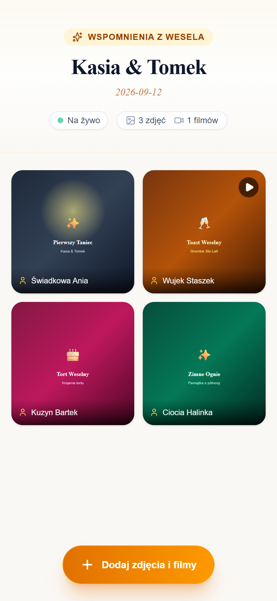
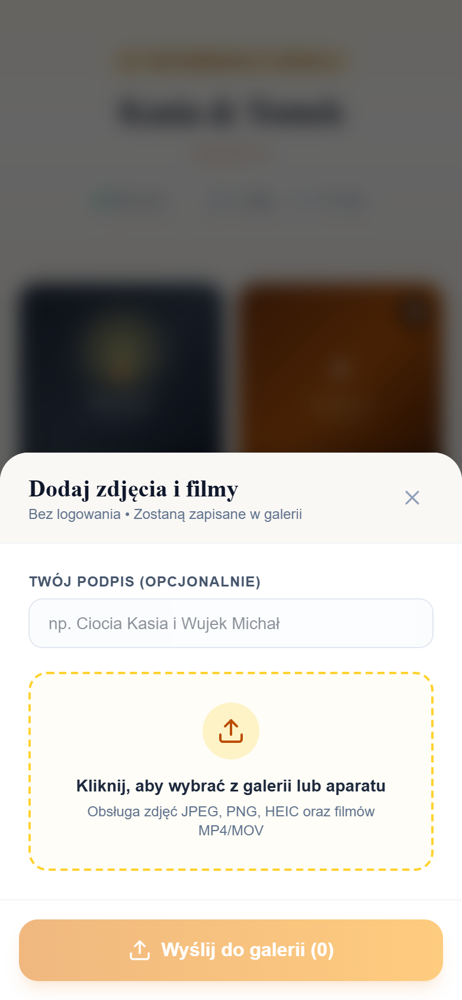
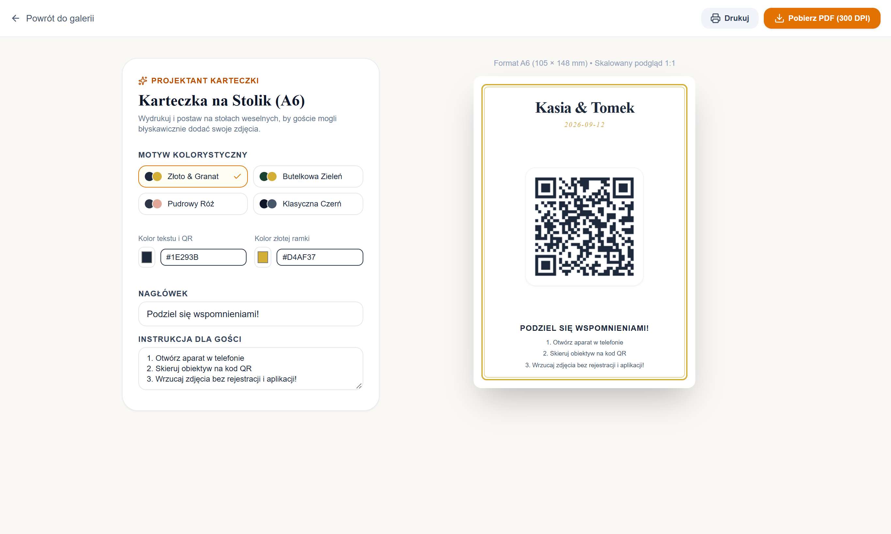
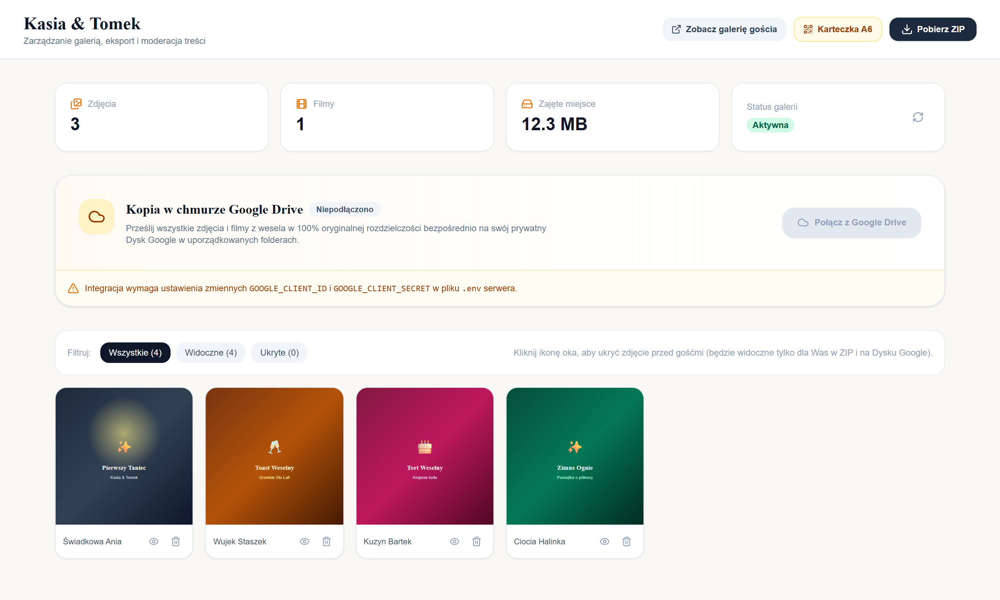
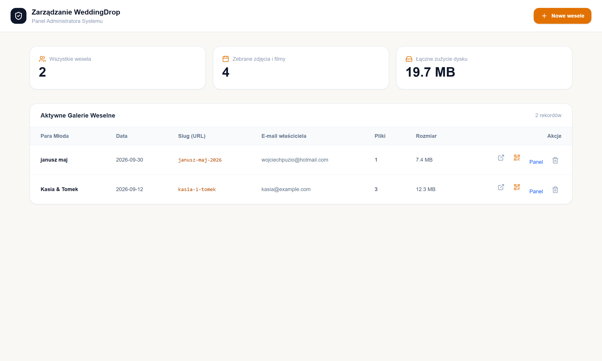

# WeddingDrop 💍 - Self-Hosted Fotowrzutka Ślubna

[](LICENSE)
[](https://nodejs.org/)
[](https://nextjs.org/)
[](docker-compose.yml)
[](turbo.json)
[](pnpm-lock.yaml)
[](biome.json)
[](package.json)
[](package.json)
[](#-optymalizacje-pod-procesor-intel-n100)

Kompletna, samoobsługowa aplikacja internetowa do zbierania zdjęć i filmów z wesel, zaprojektowana z myślą o serwerach domowych i mini-PC (np. z procesorem **Intel N100**). Działa w 100% w środowisku **Docker**, bez żadnych płatnych planów i bez limitów.

---

## 📸 Zrzuty Ekranu

### 📱 Doświadczenie Gościa Weselnego (100% Mobile First)
Bez instalacji aplikacji ze sklepów i bez rejestracji – gość skanuje kod QR ze stolika, natychmiast przegląda zdjęcia na żywo i wysyła własne prosto z rolki aparatu dzięki wznawialnemu protokołowi TUS:

<p align="center">
  
  &nbsp;&nbsp;&nbsp;&nbsp;
  
</p>

### 💌 Generator Winietek na Stoliki Weselne (Format A6 / 300 DPI)
Wbudowany wektorowy generator wizytówek na stoły z dynamicznym kodem QR, wyborem eleganckich motywów kolorystycznych i opcją natychmiastowego druku:

<p align="center">
  
</p>

### 💍 Panel Pary Młodej (Moderacja Treści, Eksport ZIP i Google Drive)
Dedykowany panel właściciela galerii chroniony hasłem – statystyki w czasie rzeczywistym, moderacja widoczności zdjęć jednym kliknięciem, pobieranie strumieniowego archiwum ZIP oraz automatyczny backup do chmury Google Drive:

<p align="center">
  
</p>

### ⚙️ Panel Główny Administratora Systemu
Szybki podgląd wszystkich ślubów, zarządzanie przestrzenią dyskową oraz błyskawiczne tworzenie nowych wesel:

<p align="center">
  
</p>

---

## 🌟 Główne Funkcje

1. **Dla Gości (100% Mobile First & PWA)**:
   - Dostęp bezpośrednio po zeskanowaniu kodu QR ze stolika weselnego.
   - Brak logowania, rejestracji i instalowania aplikacji ze sklepów.
   - **Progressive Web App (PWA)**: Możliwość instalacji na ekranie głównym (dodaj do ekranu głównego) oraz strona awaryjna (Offline Fallback) informująca o braku sieci.
   - Wrzucanie zdjęć i filmów prosto z rolki aparatu.
   - Opcjonalny podpis ("np. Wujek Janusz i Ciocia Halinka").
   - **Wznawialny upload (TUS Protocol 1.0.0)**: Jeśli na sali weselnej na chwilę zerwie się zasięg Wi-Fi lub LTE, upload wznowi się automatycznie bez utraty przesłanych danych.
   - **Galeria na żywo (SSE)**: Nowe zdjęcia pojawiają się w telefonach gości w czasie rzeczywistym bez przeładowywania widoku.
   - **Pełnoekranowa przeglądarka (Lightbox)**: Natywna obsługa gestów dotykowych **Swipe** (przesuwanie palcem lewo/prawo na smartfonach) oraz klawiatury na desktopie.
   - **Odporność na napływ zdjęć**: Przeglądanie zdjęcia w powiększeniu nie ulega zresetowaniu, gdy w tle pojawiają się nowe zdjęcia od innych gości.

2. **Dla Pary Młodej (Właściciela Galerii)**:
   - Panel zarządzania dostępny pod `/owner/[slug]`.
   - Podgląd liczby zdjęć, filmów oraz sumarycznego zajętego miejsca na dysku.
   - **Pobieranie całej galerii jako jeden plik ZIP**: Generowanie strumieniowe w locie (`archiver`) bez obciążania pamięci RAM serwera (z uwzględnieniem zdjęć ukrytych po podaniu hasła).
   - **Moderacja na żywo**: Szybkie ukrywanie zdjęć niepożądanych jednym kliknięciem oraz usuwanie — zmiana statusu natychmiast synchronizuje się ze wszystkimi telefonami na sali weselnej przez SSE (`media-updated`).
   - Bezpośredni dostęp do generatora winietki na stolik.

3. **Generator Karteczek na Stoły (Format A6 / 300 DPI)**:
   - Wektorowy generator dokumentu **PDF do druku** ze złotą ramką, imionami, datą, dynamicznym kodem QR i instrukcją.
   - Wizualny edytor z wyborem motywu barwnego (*Złoto & Granat*, *Butelkowa Zieleń*, *Pudrowy Róż*, *Klasyczna Czerń* lub własne kolory HEX).
   - Generowanie PDF na żywo z aktualnymi parametrami z formularza.
   - Opcja bezpośredniego druku (Ctrl+P) zoptymalizowana pod format A6.

4. **Dla Administratora (Panel Główny)**:
   - Dostęp pod `/admin`.
   - Bezpieczna autoryzacja kryptograficznym tokenem **HMAC-SHA256** z ochroną przed atakami czasowymi (Timing Attacks).
   - Przegląd wszystkich ślubów, liczby plików i sumarycznego zużycia dysku w oparciu o szybkie indeksy bazodanowe.
   - Błyskawiczne tworzenie nowego ślubu (formularz: imiona, data, e-mail, hasło, sanityzacja sluga).
   - Całkowite usuwanie galerii wraz ze wszystkimi plikami fizycznymi z dysku.

---

## 🚀 Szybki Start (Docker Desktop / Docker Compose)

Aplikacja jest gotowa do uruchomienia jednym poleceniem:

```bash
# 1. Przejdź do katalogu projektu
cd wedding-drop

# 2. Uruchom kontenery w tle
docker compose up -d --build
```

Docker pobierze obrazy, zbuduje aplikację i uruchomi 3 kontenery:
- `wedding_postgres` – Baza danych PostgreSQL 16 Alpine ze zoptymalizowanymi indeksami złożonymi
- `wedding_web` – Monorepo Turborepo (Node.js 24 Alpine + Next.js 16 + serwer TUS + Sharp/FFmpeg z limitem współbieżności i watchdogiem)
- `wedding_caddy` – Reverse proxy z automatycznym HTTPS i blokadą noindex

### Architektura Monorepo (pnpm + Turborepo + Biome):
- `apps/web`: Aplikacja Next.js 16, App Router, SSR, serwer HTTP (`server.ts`), komponenty i testy integracyjne.
- `packages/db`: Drizzle ORM, schemat PostgreSQL, migracje i connection pool singleton.
- `packages/media`: Potok przetwarzania mediów (Sharp, FFmpeg, TUS, SSE, PDF A6, QR, ZIP, Google Drive).

### Adresy URL w przeglądarce:
- **Strona główna**: [http://localhost](http://localhost)
- **Panel Administratora**: [http://localhost/admin](http://localhost/admin)
  - Domyślny login: `admin`
  - Domyślne hasło: `admin123` (możesz zmienić w pliku `.env`)

---

## 🐳 Instalacja z Gotowego Obrazu (ZimaOS / inny NAS z CasaOS)

Jeśli nie chcesz budować obrazu lokalnie (np. na NAS-ie ZimaOS/CasaOS), aplikacja `web` jest automatycznie budowana i publikowana przez GitHub Actions do GitHub Container Registry pod adresem `ghcr.io/p4cino/wedding-drop` (obraz `linux/amd64`, zgodny z Intel N100/ZimaBoard). Serwis `postgres` i `caddy` korzystają ze standardowych publicznych obrazów, więc do uruchomienia potrzebny jest tylko ten jeden gotowy obraz.

### Instalacja na ZimaOS:
1. W panelu ZimaOS przejdź do **App Center** → **"Install a Customized App"** → **Import** → zakładka **Docker Compose**.
2. Wklej zawartość pliku [`docker-compose.prod.yml`](docker-compose.prod.yml) z tego repozytorium.
3. **Przed kliknięciem Submit** podmień w wklejonym tekście:
   - `ADMIN_PASSWORD` (hasło do panelu `/admin`, wystawionego publicznie) — **wymagane**.
   - Porty serwisu `caddy` (domyślnie `8080`/`8443`) — sprawdź w formularzu ZimaOS, czy nie są już zajęte (bardzo częste na NAS-ach z innymi appkami — Nginx Proxy Manager, dashboard ZimaOS itp. też lubią te numery); jeśli tak, zmień na jakikolwiek wolny port.
   - `APP_DOMAIN` w serwisie `web`, jeśli chcesz, by generowane linki/kody QR wskazywały realny adres NAS-a, a nie `localhost`.
4. **Ustaw Primary Service na `caddy`**, nie `web` — `web` nie ma żadnego portu wystawionego na zewnątrz i jest dostępny tylko przez `caddy` (patrz architektura w [DOCUMENTATION.md](DOCUMENTATION.md#11-publikacja-obrazu-docker-ghcr-i-instalacja-na-zimaoscasaos)).
5. Kliknij **Submit**, a następnie **Install**.

Ten plik compose nie buduje niczego lokalnie i nie odwołuje się do żadnych plików z dysku — Caddy ściąga swój `Caddyfile` zdalnie z tego repozytorium przy starcie, więc cały stack da się wkleić jako czysty tekst YAML.

> **Coś nie działa po instalacji?** Zobacz sekcję rozwiązywania problemów w [DOCUMENTATION.md](DOCUMENTATION.md#11-publikacja-obrazu-docker-ghcr-i-instalacja-na-zimaoscasaos) — konkretne komendy do zdiagnozowania konfliktu portów, crashującego Caddy albo białej strony.

### Uruchomienie tego samego pliku przez SSH / CLI (dowolny host z Dockerem):
```bash
docker compose -f docker-compose.prod.yml up -d
```

### Aktualizacje:
- Tag `:latest` śledzi najnowszy commit na `main`.
- Wersje oznaczone tagiem (np. `v1.0.0`) są stabilne i nie zmieniają się — podmień tag w `docker-compose.prod.yml` (`image: ghcr.io/p4cino/wedding-drop:vX.Y.Z`), jeśli wolisz przypiętą wersję.

---

## ⚙️ Konfiguracja Domeny i Automatycznego Certyfikatu SSL (HTTPS)

Aby aplikacja działała na Twojej publicznej domenie z darmowym certyfikatem Let's Encrypt:

1. W pliku `.env` ustaw swoją domenę:
   ```env
   APP_DOMAIN=slub.twojadomena.pl
   ```
2. Upewnij się, że porty 80 i 443 na Twoim routerze/serwerze są przekierowane na maszynę z Dockerem.
3. Zrestartuj kontenery:
   ```bash
   docker compose up -d
   ```
   Caddy automatycznie wygeneruje i odnowi certyfikat HTTPS!

---

## ⚡ Optymalizacje pod Procesor Intel N100

- **Kolejka obróbki z throttlingiem (`concurrency: 2`)**: Procesor Intel N100 posiada 4 rdzenie Gracemont. Ograniczenie konwersji zdjęć (`Sharp`) i klatek wideo (`FFmpeg`) do 2 zadań współbieżnych chroni serwer przed przeciążeniem i gwarantuje płynną obsługę ruchu HTTP dla gości.
- **Watchdog FFmpeg (25s timeout)**: W razie napotkania uszkodzonego pliku wideo proces transkodowania jest bezpiecznie ubijany (`SIGKILL`), zapobiegając zablokowaniu kolejki zadań w tle.
- **Strumieniowany ZIP (`archiver`)**: Pakiety danych są przekazywane bezpośrednio ze strumieni dyskowych do gniazda sieciowego (`chunked transfer-encoding`). Nawet przy pobieraniu 50 GB zdjęć pamięć RAM serwera nie ulega wyczerpaniu.
- **Indeksy złożone w PostgreSQL**: Zapytania o multimedia oraz agregacje rozmiarów dyskowych korzystają z indeksów `idx_media_items_gallery_status_created` oraz `idx_media_items_gallery_size`, eliminując powolne przeszukiwania sekwencyjne.
- **Akceleracja sprzętowa Intel QuickSync (QSV)**: W pliku `docker-compose.yml` możesz odkomentować mapowanie urządzenia `/dev/dri:/dev/dri` na maszynach z systemem Linux, aby FFmpeg korzystał ze sprzętowego transkodowania wideo.

---

## 📁 Bezpieczeństwo i Prywatność

- **Brak indeksowania**: Serwer automatycznie wysyła nagłówki HTTP `X-Robots-Tag: noindex, nofollow, noarchive, nosnippet`, chroniąc prywatne zdjęcia przed robotami Google czy Bing.
- **Bezpieczne tokeny administracyjne**: Logowanie administratora generuje podpisany kryptograficznie token HMAC-SHA256 z weryfikacją `crypto.timingSafeEqual` w stałym czasie.
- **Ochrona Path Traversal i ścisła sanityzacja**: Serwowanie plików przeniesione bezpośrednio na poziom webserwera Caddy chroniąc przed wyjściem poza katalog /data. Dodatkowo działa sanityzacja `^[a-z0-9_-]+$` przy tworzeniu slugów galerii (całkowite wycięcie znaków specjalnych, spacji i sekwencji `../`).
- **Zgodność TUS z HTTPS i Reverse Proxy**: Serwer TUS działa z flagami `relativeLocation: true` oraz `respectForwardedHeaders: true`, a klient przeglądarki dynamicznie odpytuje `window.location.origin`, co całkowicie eliminuje błędy CORS i niepożądane przekierowania preflight HTTP -> HTTPS.
- **Globalny singleton SSE i odporne odświeżanie**: Magistrala zdarzeń zarejestrowana w `globalThis.__wedding_sse_bus__` oraz mechanizm ponawianego cichego odpytywania w tle (0s, 1s, 2.5s, 5s) gwarantują natychmiastowe pojawienie się zdjęć i filmów na ekranach gości zaraz po zakończeniu obróbki FFmpeg/Sharp.
- **Autoryzacja zdjęć ukrytych**: Dostęp do materiałów ukrytych (`status: "hidden"`) przez API wymaga poświadczeń właściciela galerii lub administratora (brak wycieków w publicznym JSON).
- **Haszowanie haseł**: Hasła administratora i par młodych są zabezpieczone funkcją `bcrypt` z solą.
- **Izolacja**: Pliki każdej pary są przechowywane w odrębnych podkatalogach `/data/galleries/<slug>/`.

---

## 🧪 Testy Automatyczne
 
### 1. Testy Jednostkowe i Integracyjne (Vitest)
```bash
# Uruchomienie 80 testów jednostkowych i integracyjnych w monorepo
pnpm turbo run test
# lub w kontenerze Docker (Node 24 Alpine)
docker run --rm -v "${PWD}:/app" -w /app node:24-alpine sh -c "corepack enable && pnpm -r test"
```

### 2. Testy End-to-End (Playwright)
Pakiet **32 unikalnych scenariuszy testowych (łącznie 96 testów)** uruchamianych w profilach Desktop Chromium, Mobile Chrome oraz Mobile Safari (WebKit):
```bash
# Uruchomienie pełnego zestawu Playwright E2E
pnpm --filter @wedding-drop/web test:e2e
# lub w sieci Docker
docker run --rm --network wedding-drop_wedding_net -v wedding_playwright_browsers:/ms-playwright -v "${PWD}:/app" -w /app/apps/web -e BASE_URL=http://wedding_web:3000 mcr.microsoft.com/playwright:v1.50.0-noble npx playwright test
```
Pokrywa:
- **Panel Administratora**: logowanie danymi admina, walidacja błędu hasła, tworzenie wesela, obsługa kolizji sluga, usuwanie galerii.
- **Panel Pary Młodej (Moderacja)**: logowanie hasłem, pobieranie ZIP z hasłem (w tym zdjęć ukrytych), moderacja widoczności (ukryj/pokaż), filtrowanie zakładek, usuwanie multimediów.
- **Ścieżka Gościa & Mobile UX**: przeglądanie galerii na żywo, drawer uploadu TUS, siatka zdjęć z podpisami, pełnoekranowy Lightbox z gestami **Touch Swipe** (przesuwanie palcem lewo/prawo) oraz pobieranie plików.
- **Kreator Winietek A6**: podgląd karty `#printable-card` z kodem QR, zmiana palet barwnych, edycja tekstów na żywo, generowanie wektorowego PDF (300 DPI) z parametrami w URL.
- **Bezpieczeństwo & Edge Cases**: blokada ukrytych zdjęć (401), ekran 404, ochrona sandbox Directory Traversal, pobieranie ZIP pustej galerii (400), blokada fałszywych tokenów HMAC (401), sanityzacja złośliwego sluga z path traversal.

---

## 📄 Licencja

Projekt **WeddingDrop** jest wolnym i otwartym oprogramowaniem (Free & Open Source Software) publikowanym na warunkach licencji **GNU Affero General Public License v3.0 (AGPL-3.0)**.

### Co to oznacza w praktyce?
- **Wolność użytkowania**: Możesz bezpłatnie uruchamiać i hostować aplikację na własne potrzeby prywatne oraz komercyjne (np. obsługa wesel Twoich klientów).
- **Wolność modyfikacji**: Możesz w pełni dostosowywać kod do swoich wymagań i dodawać nowe funkcje.
- **Copyleft (w duchu WordPressa)**: Jeśli zmodyfikujesz kod źródłowy WeddingDrop i udostępnisz go gościom lub klientom — w tym również **przez sieć jako usługę online (SaaS/Cloud)** — masz prawny obowiązek udostępnić pełny kod źródłowy wprowadzonych ulepszeń na tej samej licencji (AGPL-3.0).
- **Ochrona wolności społeczności**: Żadna firma ani podmiot trzeci nie może zamknąć projektu ani dystrybuować zmodyfikowanej wersji jako zamkniętego oprogramowania własnościowego (proprietary software).
- **Brak gwarancji**: Oprogramowanie jest dostarczane w stanie "tak jak jest" (AS IS), bez jakichkolwiek dorozumianych gwarancji.

Pełny, oficjalny tekst licencji znajduje się w pliku [LICENSE](LICENSE).

Copyright (C) 2026 WeddingDrop Contributors

